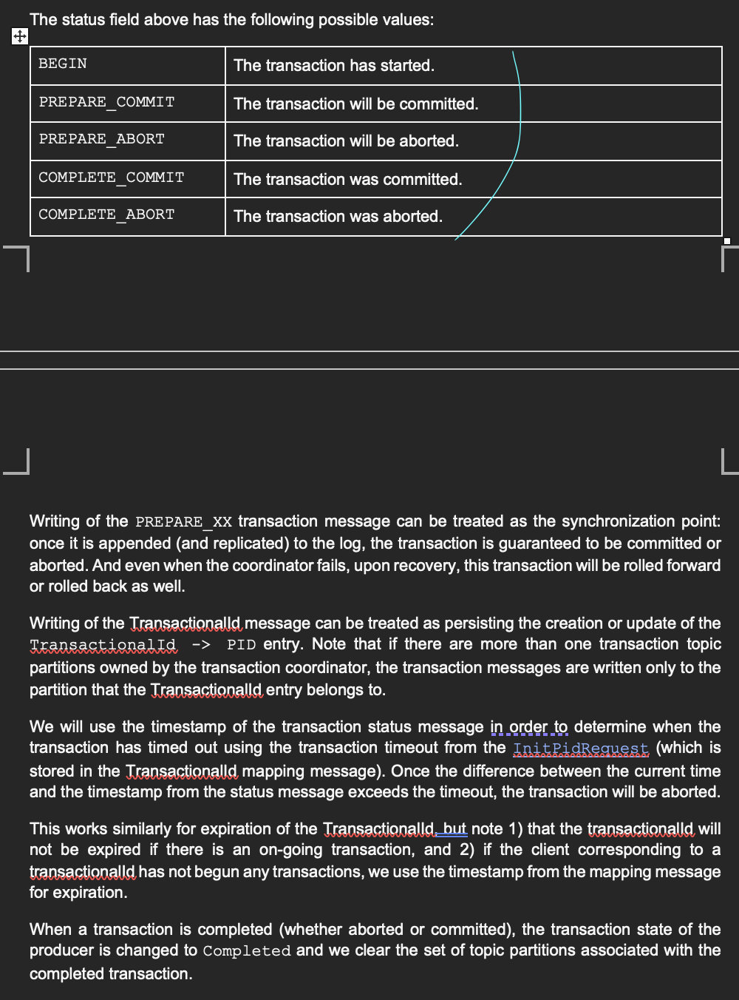

- https://d2.naver.com/helloworld/9581727
- https://px201226.github.io/trasaction_in_kafka/
- https://www.confluent.io/blog/transactions-apache-kafka/  # 특히 해당 자료, 역사

```markdown

Kafka의 트랜잭션 및 정확히 한 번의 메시지 처리는 **락(lock)**을 활용하지 않고, 
대신 **로그(log)** 기반의 설계와 **상태 관리**를 통해 동시성을 처리합니다.

1. **Transaction Coordinator와 로그 기반 관리**:  
   - Kafka는 트랜잭션 상태를 **Transaction Log**라는 내부 토픽에 기록합니다. 
     이 로그는 트랜잭션의 상태(예: BEGIN, PREPARE_COMMIT, COMPLETE_COMMIT 등)를 저장하며, 
     이를 통해 동시성을 제어하고 복구를 지원합니다.

2. **락 대신 상태 기반 동기화**:  
   - 트랜잭션 상태 변경(예: PREPARE_COMMIT 또는 PREPARE_ABORT)은 
     로그에 기록되는 시점에서 동기화가 이루어집니다. 이 방식은 락을 사용하는 대신, 
     로그 기록을 통해 트랜잭션의 원자성을 보장합니다.

3. **Idempotent Producer**:  
   - 메시지 중복 방지는 **PID**와 **Sequence Number**를 활용하여 이루어지며, 
     락 없이도 메시지의 순서와 중복을 관리할 수 있습니다.

Kafka는 락을 사용하지 않음으로써 높은 처리량과 낮은 지연 시간을 유지하며, 
분산 환경에서 효율적으로 동작할 수 있도록 설계되었습니다.
```



# 카오스 테스팅
- https://www.lydtechconsulting.com/blog-kafka-chaos-testing.html

# 아웃박스 패턴
https://techblog.woowahan.com/17386/


