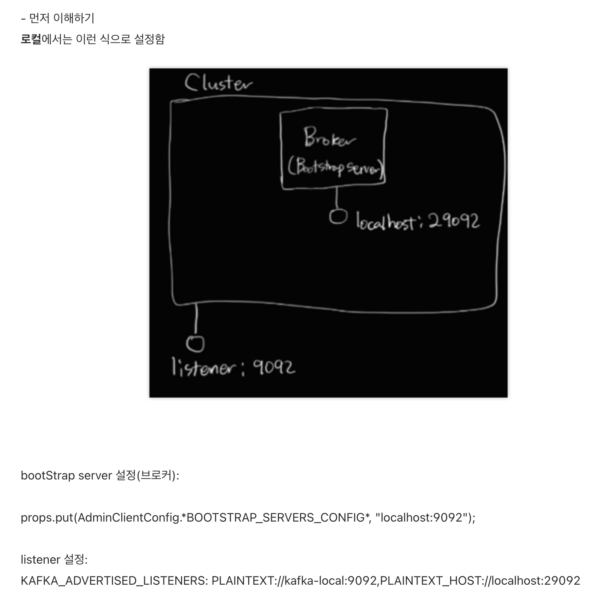
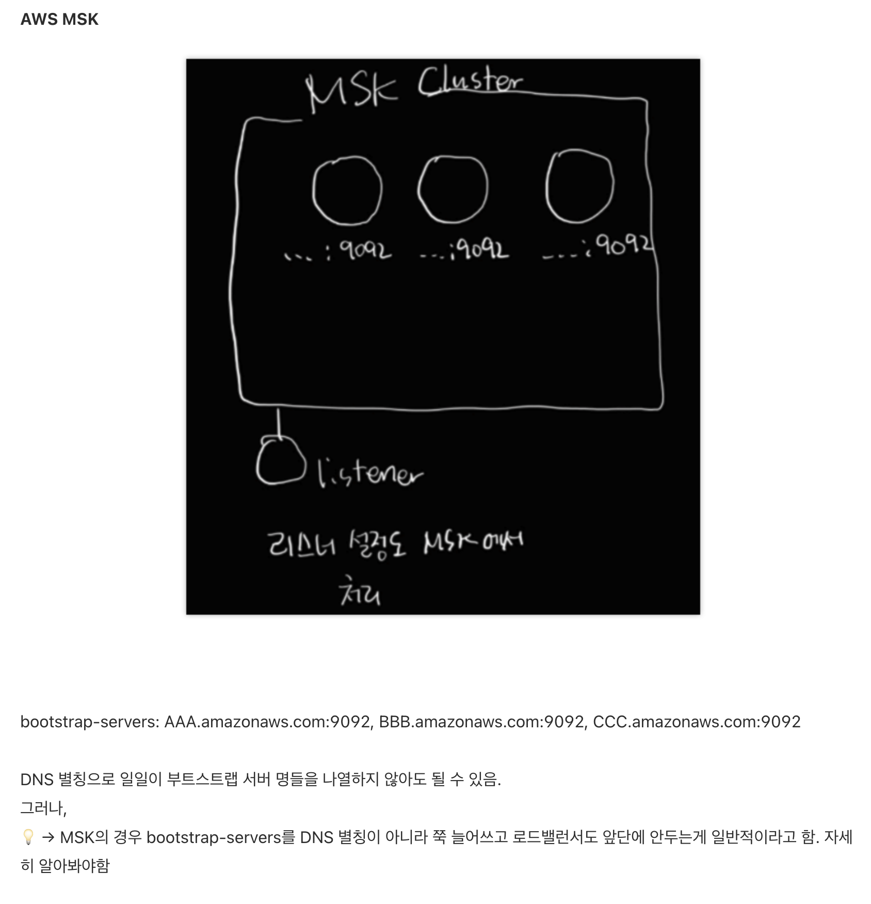
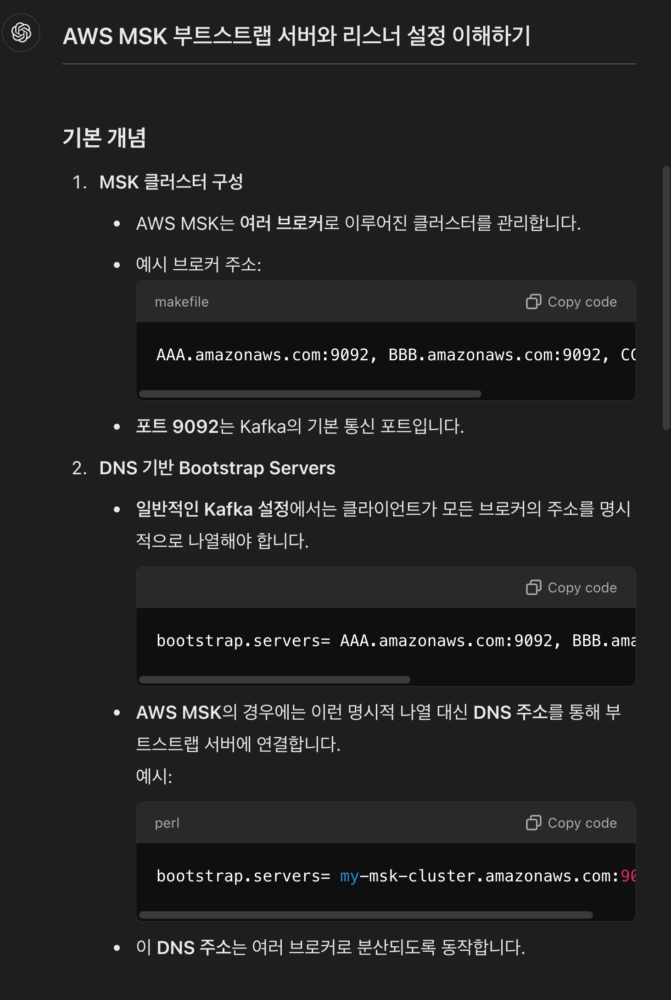
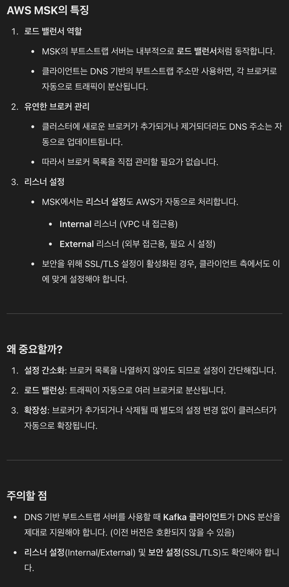

### Key takeaways
```
- client.dns.lookup=resolve_canonical_bootstrap_servers_only
- clinet.dns.lookup=use_all_dns_ips
- 카프카 컨트롤러부터 브로커로의 메타데이터 전파는 비동기적으로 이루어짐
- 카프카는 호스트명을 기준으로 연결을 검증하고 해석하고 생성
- SASL(Simple Authentication and Security Layer)은 Kafka 프로토콜이 데이터 교환 과정에서
Kafka가 지원하는 Kerberos, PLAIN, SCRAM, OAUTHBEARER 등의 메커니즘을 사용하여 인종/인가를 할 수 
있도록 해주며, 인증/인가 교환이 성공했을 때, 후속 데이터 교환을 데이터 보안 계층 위에서 할 수 있도록 해주는 기술
- adminClient는 모든 응답을 Future 객체로 감싸어 리턴
- 오프셋 토픽의 오프셋 값을 변경한다 해도 컨슈머 그룹에 변경 여부가 전달되지 않는다는 점을 명심하라
```











cf) https://whitepro.tistory.com/1033

