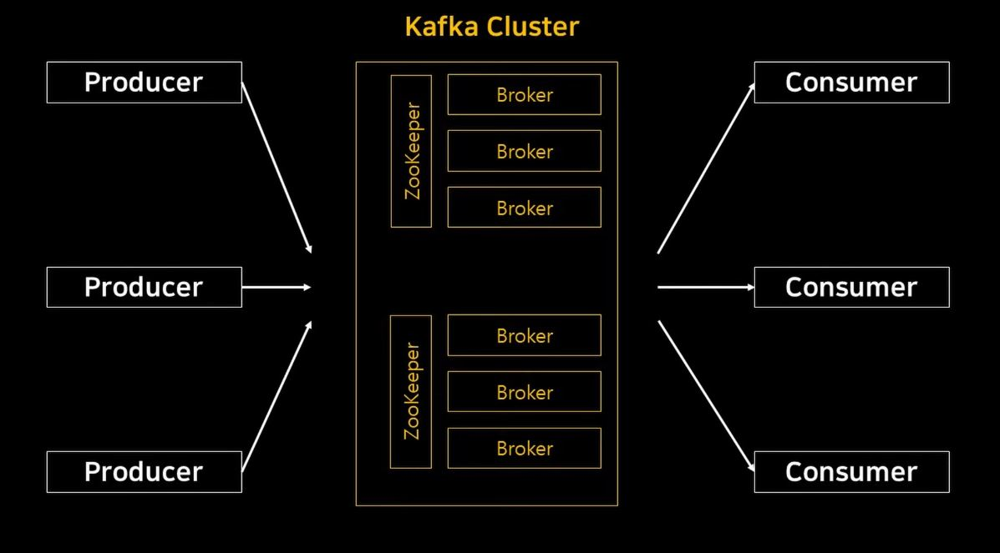

# Chapter 06. 카프카 내부 메커니즘

## **6.1 클러스터 멤버십**

- 카프카는 현재 클러스터의 멤버인 브로커들의 목록을 유지하기 위해 아파치 주키퍼를 사용한다.
- 각 브로커는 브로커 설정 파일에 정의되었거나 아니면 자동으로 생성된 고유한 식별자를 가진다.
- 브로커 프로세스는 시작될 때마다 주키퍼에 Ephemeral 노드의 형태로 ID를 등록한다.

## **6.2 컨트롤러**

- Kafka에서 컨트롤러(Controller)는 클러스터의 중요한 역할을 담당하는 브로커 중 하나로, 클러스터 메타데이터와 관리를 담당하는 특별한 브로커입니다.
- 가장 먼저 시작했다고 하여 컨트롤러가 되는 것은 아니고, ZooKeeper나 KRaft를 통해 정확한 규칙에 기반한 경쟁과정을 거쳐 결정된다.
- 브로커가 먼저 시작되었다고 하더라도, 네트워크 상태, ZooKeeper와의 연결 상태, 혹은 브로커 설정이 영향을 미쳐 다른 브로커가 컨트롤러가 될 수 있다.

### **6.2.1 KRaft: 카프카의 새로운 래프트 기반 컨트롤러**

- 주키퍼기반 컨트롤러로부터 탈피해서 래프트기반 컨트롤러 쿼럼으로 옮겨가는 것
- 왜 카프카 커뮤니티는 컨트롤러를 교체하기로 결정했을까?
  - 주키퍼에 토픽, 파티션, 레플리카 정보를 저장하는 방식을 많이 개선했는데도 불구하고 현재의 모델이 우리가 카프카에 필요로 하는 파티션 수까지 확장될 수 없다는 사실이 명백해졌다.
  - 브로커, 컨트롤러, 주키퍼 간에 메타데이터 불일치 발생 가능성
  - 파티션과 브로커의 수가 증감함에 따라 컨트롤러 재시작은 더욱 느려짐
  - 메타데이터 소유권 관련된 내부 아키텍처는 그리 좋지 못함
  - 주키퍼 그 자체로 분산시스템이라, 카프카를 사용하려는 개발자들은 두 개의 분산 시스템에 대해 배워야 함

- KRaft 도입 이전, 카프카에는 두 종류의 프로세스가 있음
  - 주키퍼 프로세스: 카프카 클러스터의 동적 메타데이터를 저장하는 역할
  - 카프카 프로세스: 카프카 데이터를 저장하는 역할

- KRaft 도입 이후, 카프카 프로세스 외에 다른 프로세스는 없음
- 카프카 프로세스가 컨트롤러, 브로커 역할을 하게 됨
  - 컨트롤러: 카프카 클러스터의 동적 메타데이터를 저장하는 역할
  - 브로커: 카프카 데이터를 저장하는 역할

- 주키퍼 없이 카프카를 운영할 수 있게 해주는 KRaft 기능은 브리지 릴리스 사용을 통해 가능.
  - 브리지 릴리스(Bridge Release): 브리지 릴리스를 통해 ZooKeeper와 KRaft 사이에서 천천히 다리를 건너는 느낌으로 전환 가능
  - 1)ZooKeeper 기반 클러스터 운영
  - 2)KRaft 기능 활성화
  - 3)ZooKeeper와 KRaft 병행 사용
  - 4)완전한 KRaft 전환

| 기능       | ZooKeeper 기반 클러스터          | KRaft 기반 클러스터          |
|----------|----------------------------|------------------------|
| 메타데이터 저장 | ZooKeeper 앙상블              | Kafka 브로커 내부(Raft 로그)  |
| 리더 선출    | ZooKeeper에서 관리             | 컨트롤러 쿼럼에서 관리           |
| 확장성      | ZooKeeper 노드 수가 병목 될 수 있음. | 더 나은 확장성 제공            |
| 구성 요소    | Kafka 브로커 + ZooKeeper 앙상블| Kafka 브로커(ZooKeeper없음) |
| 운영 복잡성   | ZooKeeper와 Kafka를 모두 관리해야 함  | 단일 Kafka 시스템으로 운영 단순화  |

## **6.3 복제**

- 카프카는 분산되고 분할되고 복제된 커밋 로그 서비스로 표현되기도 한다.
- 복제가 중요한 이유는 개별적인 노드에 필연적으로 장애가 발생할 수밖에 없는 상황에서 카프카가 신뢰성과 지속성을 보장하는 방식이기 때문이다.

#### **리더 레플리카**

- 모든 쓰기 요청을 수행함
- 어느 팔로워 레플리카가 리더 레플리카의 최신 상태를 유지하고 있는지를 확인함.
- 리더가 장애가 발생하면, Kafka의 컨트롤러가 ISR(In-Sync Replica)중 하나를 새로운 리더로 승격함.
    - ISR은 리더와 동기화 상태를 유지하고 있는 레플리카들의 집합

#### **팔로워 레플리카**
- 파티션에 속한 모든 레플리카 중에서 리더 레플리카를 제외한 나머지
- 리더 레플리카로 들어온 최근 메시지들을 복제함으로써 최신 상태 유지함

| 특징        | 리더 레플리카                     | 팔로워 레플리카 |
|-----------|-----------------------------|--|
| 주요 역할     | 	읽기/쓰기 요청 처리  | 	리더 데이터를 복제 |
| 클라이언트 통신  | 	프로듀서 및 컨슈머와 직접 통신| 클라이언트와 직접 통신하지 않음 |
| 장애 복구     | 리더가 장애 시 팔로워 중 하나가 리더로 승격  |  새로운 리더로 전환 가능|
| 데이터 복제 방향 | 없음  | 리더로부터 데이터를 복제 |
| 메타데이터 관리  | 리더로서 파티션 메타데이터 관리| 리더에게 상태 동기화|

- 리더 레플리카: Kafka 파티션의 주요 레플리카로 읽기/쓰기 요청을 처리하며, 클라이언트와 직접 통신
- 팔로워 레플리카: 리더 데이터를 복제하고 동기화 상태를 유지하며, 장애 발생시 새로운 리더로 승격 가능
- 리더와 팔로워의 협업은 Kafka의 데이터 신뢰성, 고가용성, 장애 복구를 보장하는 중요한 기초

## **6.4 요청처리**

- 카프카 브로커가 하는 일의 대부분은 클라이언트, 파티션 레플리카, 컨트롤러가 파티션 리더에게 보내는 요청을 처리하는 것이다.

#### Apache Kafka Broker 내부 요청 처리 
- 카프카 브로커의 내부 요청 처리는 Kafka 클러스터가 데이터 생산(Produce)과 소비(Consume)을 안정적으로 수행할 수 있도록 설계된 메커니즘이다.
- 브로커는 클라이언트(프로듀서/컨슈머)의 요청을 처리하고 클러스터 내부의 데이터 복제와 상태 관리 요청을 조율함
- Apache Kafka 브로커의 내부에는 요청(Request)을 처리하기 위한 다양한 스레드 모델리 설계되어 있음.
  - Accpetor 스레드, Processor 스레드, I/O 스레드
    - Acceptor 스레드: 클라이언트(프로듀서, 컨슈머 등) 또는 다른 브로커의 연결 요청을 수신함. 그리고 새로운 TCP 연결을 수락(accept)하고 이 연결을 적절한 Processor 스레드로 전달함.
    - Processor 스레드: Processor 스레드는 Acceptor로부터 전달받은 TCP연결을 통해 요청(Request)을 읽고, 처리 후 응답(Response)을 생성함
    - I/O 스레드: Kafka 클러스터 내부에서 데이터 복제를 담당함. 팔로워 브로커는 리더 브로커로부터 데이터를 요청(Fetch Request)하고, 이를 자신의 복제로그에 저장함.

#### 메타데이터 요청 처리
- 클라이언트(Producer/Consumer/Admin)가 Kafka 클러스터에 대한 정보를 요청하는 작업
- 메타데이터 요청은 Kafka 클러스터의 상태를 파악하거나 작업을 수행하기 위한 기본 정보를 얻는 데 사용됨.
- Kafka 클라이언트는 메타데이터 요청을 통해 클러스터의 구조를 이해하고, 작업(데이터 생산, 소비 등)을 효율적으로 수행할 수 있음.
- 메타데이터 요청은 Kafka 클러스터의 다음과 같은 정보를 반환함
  - 토픽 및 파티션 정보
    - 클러스터에 있는 토픽의 목록
    - 각 토픽의 파티션 개수
    - 각 파티션의 리더(Leader)와 복제본(Replicas)정보
  - 브로커 정보
    - Kafka Cluster에 있는 브로커의 목록
    - 각 브로커의 ID와 호스트 이름
  - 파티션 상태
    - 특정 토픽의 각 파티션에 대한 리더 브로커 ID
    - ISR(In-Sync Replica) 목록

### **6.4.1 쓰기 요청**
- 프로듀서가 Kafka 브로커에 데이터를 보낼 때 사용하는 요청
- acks: 브로커는 요청에 대한 성공 여부를 프로듀서에 응답함.
  - acks=0: 응답을 기다리지 않음
  - acks=1: 리더에만 데이터가 쓰이면 응답
  - acks=all: ISR에 있는 모든 레플리카로 데이터가 복제되었을 때 응답

- 요청 흐름
  - 1)프로듀서 → 리더 브로커 (쓰기 요청)
  - 2)리더 브로커 → 팔로워 브로커 (데이터 복제)
  - 3)리더 브로커 → 프로듀서(ACK 응답)

### **6.4.2 읽기 요청**
- 클라이언트는 브로커에 토픽, 파티션 그리고 오프셋 목록에 해당하는 메시지들을 보내 달라는 요청을 보낸다.
- 이때, 클라이언트는 각 파티션에 대해 브로커가 리턴할 수 있는 **최대 데이터의 양** 역시 지정한다.
  - "보낼 데이터가 최소한 10K 바이트 쌓이면 결과를 리턴하라" 라고 데이터 양을 지정할 수 있다.
- 브로커가 충분한 데이터를 가질 때까지 클라이언트가 마냥 기다리기만 하는 것을 원하지는 않을때 **타임아웃**을 지정할 수 있다.
    - "만약 x밀리초 안에 하한만큼의 데이터가 모이지 않으면 그냥 있는 것이라도 보내라"

- 파티션 리더에 존재하는 모든 데이터를 클라이언트가 읽을 수 있는 건 아니다. 대부분의 클라이언트는 모든 인-싱크 레플리카에 쓰여진 메시지들만 읽을 수 있을 뿐이다. 왜냐하면 충분한 수의 레플리카에 복제가 완료되지 않은 메시지는 불안전한 것으로 간주되기 때문이다.
- 읽기 세션 캐시(Fetch Session Cache) 사용하여 컨슈머는 읽고 있는 파티션의 목록과 그 메타데이터를 캐시하는 세션을 생성할 수 있다. 왜냐하면 읽고자 하는 파티션의 집합이나 여기에 연관된 메타데이터는 여간해서는 잘 바뀌지 않는 데다가, 많은 경우 리턴해야 할 메타데이터가 그렇게 많지도 않기 때문이다.

| 쓰기 요청(Produce Request)   | 읽기 요청(Fetch Request)     |
|--------------------------|--------------------------|
| 프로듀서가 데이터를 브로커에 전송       | 	컨슈머가 데이터를 브로커에서 읽음      |
| 리더 브로커에 데이터를 기록 후 복제     | 리더 브로커에서 오프셋 기준으로 데이터 반환 |
| 데이터 가용성과 일관성 조정을 위한 acks | 오프셋 관리를 통한 데이터 중복/누락 방지  |

### **6.4.3 기타 요청**

## **6.5 물리적 저장소**

- 카프카의 기본 저장 단위: 파티션 레플리카 (Partition Replica)
- 카프카가 데이터를 저장하기 위해 사용 가능한 디렉토리들을 어떻게 활용?  
① 데이터가 클러스터 안의 브로커, 브로커 안의 디렉토리에 할당되는 방식  
② 브로커가 파일을 관리하는 방법  
③ 파일 내부로 초점을 옮겨 데이터가 저장되는 파일과 인덱스 형식  
④ 카프카를 장시간용 데이터 저장소로 사용할 수 있게 해주는 고급 기능인 로그 압착 기능을 설명하고 작동원리를 알아볼 것  

### **6.5.1 계층화된 저장소**

- 계층화된 저장소 기능에서는 카프카 클러스터의 저장소를 로컬과 원격, 두 계층으로 나눈다.
- 로컬 계층: 현재의 카프카 저장소 계층과 똑같이 로컬 세그먼트를 저장하기 위해 카프카 브로커의 로컬 디스크를 사용한다.
- 원격 계층: 완료된 로그 세그먼트를 저장하기 위해 HDFS나 S3와 같은 전용 저장소 시스템을 사용한다.

### **6.5.2 파티션 할당**

- 
### **6.5.3 파일 관리**

- 카프카는 영구히 데이터를 저장하지도, 데이터를 지우기 전에 모든 컨슈머들이 메시지를 읽어갈 수 있도록 기다리지도 않는다.
- 보존 기한(retention period)를 설정하여 특정 기간이나 데이터 용량을 초과하면 삭제하는 것을 설정할 수 있다.
- Kafka는 데이터 삭제 작업을 수행할 때, 세그먼트 단위로 데이터를 처리함
  - 하나의 파티션을 여러 세그먼트로 분할
  - 카프카가 파티션 단위로 메시지를 쓰는 만큼 각 세그먼트 한도가 다 차면 세그먼트를 닫고 새 세그먼트를 생성한다.
  - Active Segment: Log Segment파일 중에서 현재 데이터를 기록중인 세그먼트를 의미.

### **6.5.4 파일 형식**

- 각 세그먼트는 하나의 데이터 파일 형태로 저장됨. 파일 안에는 카프카의 메시지와 오프셋이 저장됨
- 카프카 메시지는 사용자 페이로드와 시스템 헤더 두 부분으로 나누어짐
  - 사용자 페이로드: key값, value값, 헤더 모음
  - 시스템 헤더: 자체적인 key/value 순서쌍
- 카프카 프로듀서는 언제나 메시지를 배치 단위로 전송한다. 그래서 하나의 메시지만 보낼 경우 배치는 약간의 오버헤드가 발생하지만, 배치당 2개 이상의 메시지를 보낼 경우에는 메시지를 배치 단위로 묶음으로써 공간을 절약하게 되어 네트워크 대역폭과 디스크 공간을 덜 사용하게 된다.
- 카프카 배치: 트랜잭션 커밋 등을 가리킴

### **6.5.5 인덱스**
- 토픽 파티션의 메시지를 빠르게 검색할 수 있도록 설계된 데이터 구조
- 오프셋 인덱스(Offset Index)와 시간 인덱스(Time Index) 존재
  - 오프셋 인덱스: 메시지의 오프셋과 물리적 파일 위치를 매핑
  - 시간 인덱스: 타임스탬프와 오프셋을 매핑
- 인덱스들 역시 세그먼트 단위로 분할된다.

### **6.5.6 압착**

- 카프카는 설정된 기간 동안만 메시지를 저장하며, 보존 시간이 지나간 메시지들은 삭제한다.
- 카프카 두 가지 보존 정책
  - 삭제(delete) 보존 정책: 지정된 보존 기한보다 더 오래된 이벤트들을 삭제한다.
  - 압착(compact) 보존 정책: 토픽에서 각 키의 가장 최근 값만 저장하도록 한다.

### **6.5.7 압착의 작동 원리**

### **6.5.8 삭제된 이벤트**

특정 키를 갖는 모든 메시지를 삭제하고 싶을 때 어떻게?

- 해당 키값과 null 밸류값을 갖는 메시지를 써주면 된다.
- tombstome 메시지: 밸류가 null인 메시지

### **6.5.9 토픽은 언제 압착되는가?**

- 삭제 정책, 압착 정책 모두현재의 액티브 세그먼트에서는 적용되지 않는다.
- 토픽 내용물의 50% 이상이 더티 레코드인 경우에만 압착을 시작한다.  
< 압착 기능 목표 >  
① 토픽을 지나치게 자주 압착하지 않는다.  
② 너무 많은 더티 레코드가 존재하지 않도록 한다.  
<압착이 시작되는 시점 조절하는 매개변수>
- min.compaction.lag.ms: 메시지가 쓰여진 뒤 압착될 때까지 지나가야 하는 최소시간 
- max.compaction.lag.ms: 메시지가 쓰여진 뒤 압착이 가능해질 때까지 딜레이 될 수 있는 최대 시간