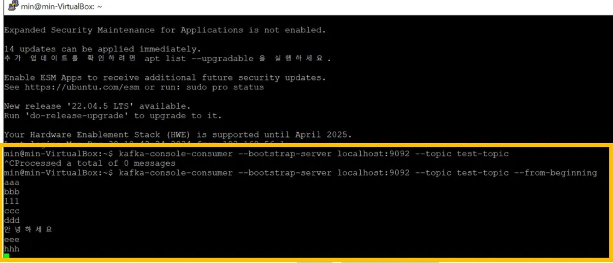

# Chapter 07. 신뢰성 있는 데이터 전달

## **7.1 신뢰성 보장**

- 보장이란 서로 다른 상황에서도 시스템이 지킬 것이라 보장되는 행동을 의미한다.
- 아파치 카프카는 무엇을 보장할까?
  - 카프카는 파티션 안의 메시지들 간에 순서를 보장한다. 
  - 클라이언트가 쓴 메시지는 모든 인-싱크 레플리카의 파티션에 쓰여진 뒤에야 '커밋'된 것으로 간주된다.
  - 커밋된 메시지들은 최소 1개의 작동 가능한 레플리카가 남아 있는 한 유실되지 않는다.
  - 컨슈머는 커밋된 메시지만 읽을 수 있다.


## **7.2 복제**

- 카프카의 복제 메커니즘은 파티션별로 다수의 레플리카를 유지한다는 특성과 함께 카프카의 신뢰성 보장의 핵심이라고 할 수 있다.
- 하나의 메시지를 여러 개의 레플리카에 씀으로써 카프카는 크래시가 나더라도 메시지의 지속성을 유지한다.   
---
[ 복제 메커니즘 ]

- 레플리카(Replica): Kafka는 데이터 내구성을 보장하기 위해 파티션의 복사본을 여러 브로커에 유지함.
- 이 복사본을 레플리카(Replica)라고 하며, 각 파티션에는 다음 두 가지 유형의 레플리카가 존재함.
  - 리더 레플리카: 파티션의 데이터를 읽고 쓰는 주체
  - 팔로워 레플리카: 리더의 데이터를 복제하는 역할

- 레플리카는 파티션의 리더 레플리카이거나 아니면 아래의 조건을 만족하는 팔로워 레플리카인 경우 **인-싱크 상태**인 것으로 간주된다.  
1. 주키퍼와의 활성 세션이 있다.  
→ 팔로워 레플리카가 ISR에 남아있으려면, 주키퍼와의 활성 세션을 유지하고, 최근 6초 내에 하트 비트를 전송했어야 함.  
→ zookeeper.session.timeout.ms = 6000 (6초)  
  
2. 최근 10초 사이 리더로부터 메시지를 읽어왔다.
3. 최근 10초 사이에 리더로부터 읽어 온 메시지들이 가장 최근 메시지이다. 즉, 팔로워가 리더로부터 메시지를 받고 있는 것만으로는 부족하다. 최근 10초 사이 랙(lag, 지연)이 없었던 적이 최소 1번은 있어야 한다.  
→ 팔로워 레플리카가 ISR에 머무르기 위해 리더와의 랙(lag, 지연)이 replica.lag.time.max.ms안에 해결되어야 함.  
→ 즉, 팔로워가 리더로부터 데이터를 받고 이를 정상적으로 복제한 상태를 10초내에 최소 한 번 보여야 ISR로 간주함.
---
[ 아웃-오브-싱크 상태로 될 수 있는 두 가지 이유 ]  
1. 레플리카와 주키퍼 사이의 연결이 끊어지거나, 새 메시지를 읽어오길 중단하거나
2. 최근 10초 동안의 업데이트 내역을 따라오지 못한 경우

→ 동기화가 풀린 레플리카는 주키퍼와 다시 연결되어 리더 파티션에 쓰여진 가장 최근 메시지까지를 따라잡으면 다시 인-싱크 레플리카가 된다.

---
동기화가 살짝 늦은 인-싱크 레플리카가 프로듀서와 컨슈머를 느리게 만들 수 있다. 왜냐하면 프로듀서는 해당 레플리카가 메시지 복제할 때까지 기다려야 하고, 컨슈머 역시 커밋된 메시지를 읽기 위해 기다려야 하기에 처리 속도가 느려진다. 그러다가 동기화가 풀린 Out-of-Sync Replica는 더 이상 ISR 목록에 포함되지 않으면 프로듀서와 컨슈머는 해당 Replica를 무시하기에 성능에 영향을 미치지 않는다. ISR 목록에 포함되지 않기에 ISR 수가 줄어들고 그로 인해 복제본의 안정성이 떨어지고 클러스터의 신뢰성과 가용성에도 영향을 미치게 된다.

---
## **7.3 브로커 설정**

- Kafka에서는 설정이 **브로커 단위**와 **토픽 단위**로 적용될 수 있다. 이 차이점을 이해하면 Kafka 클러스터를 효율적으로 관리하고 특정 요구사항에 맞게 최적화할 수 있다.
- 브로커 단위 설정은 Kafka 클러스터의 개별 브로커에서 전역적으로 적용됩니다. 이 설정은 해당 브로커가 호스팅하는 **모든 토픽과 파티션**에 영향을 미칩니다.

```
log.retention.hours=168 # 메시지가 유지되는 기본 시간
log.segment.bytes=1073741824 # 로그 세그먼트 파일의 최대 크기
num.network.threads=3 # 네트워크 요청을 처리하는 스레드 수
```

위 설정은 이 브로커에 호스팅된 모든 토픽에 기본적으로 적용됨

- 토픽 단위 설정은 특정 토픽에만 적용되는 설정입니다. 브로커 단위 설정을 무시하고 해당 토픽에만 예외적으로 적용됩니다.
- 토픽 단위 설정을 이용하여 신뢰성이 필요한 토픽과 아닌 토픽을 같은 카프카 클러스터에 저장할 수 있다.

```
kafka-topics.sh --alter \
    --topic user-activity \
    --config retention.ms = 3600000 \
    --config max.message.bytes = 2097152
```

이 설정은 user-activity 토픽의 메시지를 1시간(3600000ms) 동안만 유지, 해당 토픽의 메시지 크기 제한을 2MB(2097152 bytes)로 설정

### **7.3.1 복제 팩터**
- 복제 팩터 **토픽** 단위 설정: replication.factor
- 복제 팩터 **브로커** 단위 설정: default.replication.factor

- 토픽의 복제팩터가 3이라면, 이는 각 브로커가 3대의 서로 다른 브로커에 3개 복제된다는 것을 의미한다.
- 복제 팩터가 N이면 (N-1)개의 브로커가 중단되더라도 데이터를 읽거나 쓸 수 있다. 따라서, 복제 팩터가 클수록 가용성과 신뢰성은 늘어나고 장애 발생 가능성이 줄어든다. 대신에 N개의 복사본을 저장해야 하므로 N배의 디스크 공간이 필요하다.

- 토픽에 몇 개의 Replica가 적절한지 결정할 때 핵심 고려 사항  
1. 가용성
2. 지속성
3. 처리량
4. 종단 지연
5. 비용

- 카프카는 언제나 같은 파티션의 레플리카들을 서로 다른 브로커에 저장한다. 하지만 만약 같은 파티션의 모든 레플리카들이 같은 랙에 설치되어 있는 브로커들에 저장되었다면 랙 스위치가 오작동할 경우, 복제 팩터하고는 상관없이 해당 파티션을 사용할 수 없게 된다. 
- 그렇기에 랙 단위 사고를 방지하기 위해 브로커들을 서로 다른 랙에 배치한 뒤 broker.rack 브로커 설정 매개변수에 랙 이름을 잡아 줄 것을 권장한다.
- 랙 인식 (Rack awareness) 배치 목표  
1. 같은 파티션의 레플리카가 서로 다른 랙에 배치되도록 노력
2. 가능한 한 고르게 분산되도록 레플리카를 배치

### **7.3.2 언클린 리더 선출**

- 브로커 단위 설정
```
# Kafka는 복제본 중 ISR(In-Sync-Replica)에 있는 노드에서만 새로운 리더를 선택함.
unclean.leader.election.enable=false #기본값

# ISR에 없는 복제본을 리더로 선출 가능.
unclean.leader.election.enable=true
```
- 클린 리더 선출 (Clean Leader Election)
  - ISR에 있는 레플리카 중 하나가 리더로 선출되며, 데이터 손실이 발생하지 않는 상황을 클린 리더 선출이라고 함.
- 언클린 리더 선출 (Unclean Leader Election)
  - ISR이 아닌 레플리카(리더와 동기화되지 않은 레플리카)가 리더로 선출되는 상황
  - 데이터 손실 가능성 있는 상태에서 리더를 선출해야 하는 비정상적인 경우

[ 작동 불능에 빠진 리더 외에 인-싱크 레플리카가 없는 상황 = 인-싱크 레플리카가 리더 레플리카만 있는 상황 ]  
1. 파티션에 3개의 레플리카가 있고, 팔로워 2개가 작동 불능에 빠진 경우, 프로듀서는 리더에 쓰기 작업을 계속할 것이므로 모든 메시지는 커밋되고 응답이 간다
2. 파티션에 3개의 레플리카가 있고, 네트워크 문제가 발생하여 팔로워 2개의 복제 작업이 뒤쳐진 경우, 복제 작업이 계속 되지만 더 이상 인-싱크 상태는 아니다.

[이런 상황에서 우리는 둘 중에 하나의 결정을 해야 한다.]  
1. 아웃-오브-싱크 레플리카가 새 리더가 될 수 없도록 한다면, 예전 리더가 복구될 때까지 해당 파티션은 오프라인 상태가 된다.
2. 아웃-오브-싱크 레플리카가 새 리더가 될 수 있도록 한다면, 데이터의 유실과 일관성 깨짐의 위험성이 있다.  


### **7.3.3 최소 인-싱크 레플리카**
- 토픽과 브로커 단위 모두 min.insync.replicas 설정에서 잡아줄 수 있다.
- min.insync.replicas: ISR에 있어야 하는 최소 레플리카 수
- 토픽에 레플리카가 3개 있고, min.insync.replicas를 2로 잡아줬다면 프로듀서들은 3개의 레플리카 중 최소 2개가 인-싱크 상태인 파티션에만 쓸 수 있다.

### **7.3.4 레플리카를 인-싱크 상태로 유지하기**
- Out-of-Sync Replica: 리더와 데이터 복제를 제대로 동기화하지 못하고 뒤쳐지는 상태
- Out-of-Sync가 될 수 있는두 가지 이유
  - 주키퍼와 활성 세션을 유지해야 하는데, 주키퍼와의 연결이 끊어지거나
  - 리더 업데이트 내역을 따라가는 데 실패해서 복제 랙(lag, 지연)이 발생하거나

- zookeeper.session.timeout.ms
  - 카프카 브로커와 주키퍼 간 세션이 유지될 최대 시간
  - 브로커는 zookeeper.session.timeout.ms 시간 동안 주키퍼와의 연결을 유지하기 위해 주기적으로 하트 비트를 전송해야 함.
  - 만약 이 시간동안 하트비트를 주키퍼로 보내지 못하면 주키퍼는 해당 브로커가 더이상 호환성 상태가 아닐고 판단하고 세션을 종료함.
  - 18초 : 18초 동안 하트비트를 주키퍼로 보내지 못하면 주키퍼와는 해당 브로커가 더이상 활성상태가 아니라고 판단하고 세션 종료

- replica.lag.time.max.ms
  - 팔로워 레플리카가 리더에게 데이터를 복제하지 못한 상태로 허용되는 최대 시간(밀리초)을 설정함.
  - replica.lag.time.max.ms = 10000 : 팔로워 레플리카가 10초동안 리더 레플리카와 동기화를 유지하지 못하면 ISR에서 제거됨.

### **7.3.5 디스크에 저장하기**

## **7.4 신뢰성 있는 시스템에서 프로듀서 사용하기**

### **7.4.1 응답 보내기**
- ACKS 옵션: 프로듀서가 메시지를 전송할 때 브로커로부터의 응답을 얼마나 기다릴지 결정하는 설정

  - ACKS=0
    - ACKS=0일때, 프로듀서는 메시지를 브로커에 보낸 후 브로커의 응답을 기다리지 않기에 프로듀서가 네트워크로 메시지를 전송한 시점에서 메시지가 카프카에 성공적으로 쓰여진 것으로 간주된다.
    - 따라서, 프로듀서는 즉시 다음 메시지를 보낼 수 있어 지연은 낮지만, 브로커 내부의 처리 지연은 여전히 존재하기 때문에 종단 지연은 개선되지 않는다.
    - 지연(Latency)
      - 시스템에서 한 단계의 작업이 완료되기까지 걸리는 시간
      - 일반적으로 프로듀서 → 브로커 → 컨슈머의 데이터 전송 과정 중 특정 구간에서 발생하는 지연을 나타냄
    - 종단 지연(End-to-End Latency)
      - 데이터가 시스템의 시작점에서 끝점까지 전달되는데 걸리는 전체 시간
      - 데이터가 프로듀서 → 브로커 → 컨슈머를 거치는 전체 시간
  - ACKS=1
    - 리더 파티션에 데이터를 전송하고, 리더 파티션이 데이터를 정상적으로 받았는지 응답을 받는다. 단, 팔로워 파티션들에 정상적으로 복제되었는지는 알 수 없다. 
    - 리더 파티션이 데이터를 전달 받고 브로커 장애가 발생한다면 팔로워 파티션에 데이터를 복제하지 못하므로 데이터 유실 가능성이 있다.
  - ACKS=ALL
    - 프로듀서는 메시지를 전송한 후, 모든 ISR(In-Sync Replica)가 메시지를 성공적으로 복제했음을 확인받아야만 브로커로부터 ACK(확인응답)을 받는다. 
    - min.insync.replicas
      - ISR에 속한 레플리카의 최소 개수
      - 리더 레플리카를 포함하여 min.insync.replicas 이상의 레플리카가 복제를 완료해야만 데이터가 성공적으로 기록됩니다.
      - 예를 들어, min.insync.replicas=2라면 리더 레플리카 1개 + 팔로워 레플리카 1개인 것이다. 즉, 총 2개의 레플리카가 ISR에 포함되어야 데이터를 성공적으로 기록할 수 있음을 의미합니다.
### **7.4.2 프로듀서 재시도 설정하기**

- 프로듀서는 재시도 가능한 에러(retriable error)를 처리할 수 있다.
- 프로듀서가 브로커에 메시지를 전송하면 브로커는 성공 혹은 에러 코드를 리턴할 수 있다.
- 에러코드는 전송을 재시도하면 해결될 수 있는 것과 아닌 것 두 부류로 나뉘어진다.
  - LEADER_NOT_AVAILABLE: 재시도 가능한 에러
  - INVALID_CONFIG: 재시도 불가능한 에러
- 메시지가 유실되지 않는 것이 목표일 경우, 가장 좋은 방법은 재시도 가능한 에러가 발생했을 경우 프로듀서가 계속해서 메시지 전송을 재시도하도록 설정하는 것이다.
- MAX_INT를 default값으로 두고 delivery.timeout.ms를 최대로 두어, 프로듀서는 이 시간 간격 내에 있는 한 메시지 전송을 계속해서 재시도 한다. 
- 하지만 이렇게 전송 실패한 메시지를 재시도하는 것은 메시지가 중복될 위험을 내포하고있다.
- 그렇기에 enable.idempotence=true로 설정해주므로 프로듀서가 추가적인 정보를 레코드에 포함할 수 있도록, 그리고 이를 활용해서 브로커가 재시도로 인해 중복된 메시지를 건너뛸 수 있도록 한다.
  - idempotence : 멱등성
  - 멱등성이란 동일한 작업을 여러 번 수행하더라도 결과가 동일하게 유지되는 속성을 의미.

```
# 프로듀서가 동일한 메시지를 중복으로 전송하는 것을 방지하여 메시지의 일관성과 중복 방지를 보장하기 위해 사용됨.

enable.idempotence=true

```

```
from kafka import KafkaProducer

producer = KafkaProducer(
    bootstrap_servers='localhost:9092',
    enable_idempotence=True, # 멱등성 활성화
    acks='all', # enable.idempotence=true로 설정하면, acks=all이 강제됨 
    retries = 5 # 재시도 횟수 설정
)

producer.send('my-topic', b'Hello Kafka')
producer.close()
```

### **7.4.3 추가적인 에러 처리**

1. 메시지 크기에 관련되었거나 인가 관련 에러와 같이 재시도가 불가능한 브로커 에러  
→ 메시지 크기, 인증/인가 문제, 브로커 설정 오류 등으로 발생하는 오류로 프로듀서가 동일한 요청을 다시 시도해도 성공할 가능성이 없는 상황
2. 메시지가 브로커에 전송되기 전에 발생한 에러 (예, 직렬화 과정에서 발생한 에러)
3. 프로듀서가 모든 재전송 시도를 소진했거나, 재시도 과정에서 프로듀서가 사용하는 가용 메모리가 메시지로 가득차서 발생하는 에러
4. 타임아웃

## **7.5 신뢰성 있는 시스템에서 컨슈머 사용하기**

- 컨슈머는 카프카에 커밋된 데이터만 읽을 수 있다. 즉, 모든 인-싱크 레플리카에 쓰여진 다음부터 읽을 수 있는 것이다.
  - 커밋된 메시지: 메시지가 커밋되었다는 것은 메시지가 ISR에 있는 모든 복제본에 복제되었다는 것을 의미
- 컨슈머가 해야 할 일은 어느 메시지까지 읽었고, 어디까지는 읽지 않았는 지를 추적하는 것 (누락 되지 않도록 하기 위해)
- 컨슈머가 읽어온 오프셋을 커밋해야 함. 그래야 읽고 있는 각 파티션에 대해 어디까지 읽었는 지를 저장해 둬야 해당 컨슈머나 다른 컨슈머가 재시작한 뒤에도 어디서부터 작업을 계속해야 할지 알 수 있기 때문이다.
- 커밋된 메시지 vs 커밋된 오프셋
  - 커밋된 메시지: 모든 인-싱크 레플리카에 쓰여져서 컨슈머가 읽을 수 있는 메시지
  - 커밋된 오프셋: 컨슈머가 특정 파티션 어느 오프셋까지의 모든 메시지를 받아서 처리를 완료했는지를 알리기 위해 카프카에 보낸 오프셋

### **7.5.1 신뢰성있는 처리를 위해 중요한 컨슈머 설정**

1. group.id  
→ 컨슈머 그룹을 정의함.  
→ 컨슈머 그룹은 특정 그룹에 속한 컨슈머들이 협력하여 Kafka 토픽의 메시지를 처리할 수 있도록 구성된 논리적 단위.
2. auto.offset.reset
→ 커밋된 오프셋이 없을 때나 컨슈머가 브로커에 없는 오프셋을 요청할 때 컨슈머가 어떻게 해야 할 지를 결정  
→ earliest: 파티션 맨 앞부터 읽기 시작 , --from -beginning 사용해야 출력됨.  
→ latest: 파티션 맨 끝부터 읽기 시작  
```
kafka-console-consumer --bootstrap-server localhost:9092 --topic test-topic --from-beginning
```


3. enable.auto.commit  
→ 일정한 시간에 맞춰 컨슈머가 알아서 오프셋을 커밋하게 할 것인가, 아니면 코드에서 직접 오프셋을 커밋하게 할 것인가/ 하는 것

4. auto.commit.interval.ms  
→ 오프셋을 자동으로 커밋할 경우, 이 설정을 사용해서 커밋되는 주기를 설정할 수 있다.

### **7.5.2 컨슈머에서 명시적으로 오프셋 커밋하기**

- 데이터를 신뢰성 있게 다루는 컨슈머를 개발할 때 고려해야 할 중요한 사항들
1. 메시지 처리 먼저, 오프셋 커밋은 나중에
2. 커밋 빈도는 성능과 크래시 발생시 중복 개수 사이의 트레이드 오프다.
3. 정확한 시점에 정확한 오프셋을 커밋하자
4. 리밸런스
5. 컨슈머는 재시도를 해야할 수도 있다.
6. 컨슈머가 상태를 유지해야할 수도 있다.

## **7.6 시스템 신뢰성 검증하기**

우리는 일단 몇 가지 검증 작업을 먼저 한 뒤, 세 개의 계층에 걸쳐서 검증을 수행할 것을 제안한다.
즉, 설정 검증, 애플리케이션 검증, 그리고 프로덕션 환경에 배포된 애플리케이션 모니터링이다.

### **7.6.1 설정 검증하기**

### **7.6.2 애플리케이션 검증하기**

### **7.6.3 프로덕션 환경에서 신뢰성 모니터링하기**
