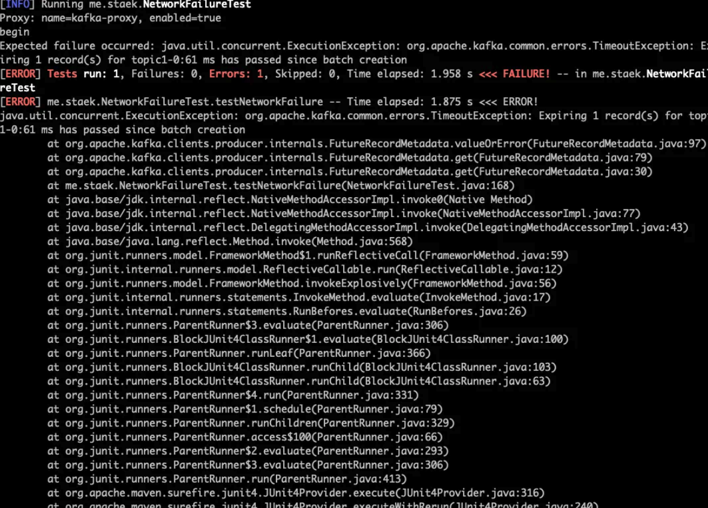

# Amazon 2023 환경에서 kafka, toxiproxy 설치 후 트랜잭션을 테스트합니다.


## jdk install

```java
# OpenJDK 17 직접 다운로드
wget <https://download.java.net/java/GA/jdk17/0d483333a00540d886896bac774ff48b/35/GPL/openjdk-17_linux-x64_bin.tar.gz>

# 압축 해제
tar xf openjdk-17_linux-x64_bin.tar.gz

# /opt로 이동
sudo mv jdk-17 /opt/

# 환경 변수 설정
echo "export JAVA_HOME=/opt/jdk-17" >> ~/.bashrc
echo "export PATH=\\$PATH:\\$JAVA_HOME/bin" >> ~/.bashrc

source ~/.bashrc

java -version
```


## kafka install

```java
# Kafka 다운로드
wget <https://downloads.apache.org/kafka/3.9.0/kafka_2.13-3.9.0.tgz>

# 압축 해제
tar -xzf kafka_2.13-3.9.0.tgz

# 디렉토리 이동
cd kafka_2.13-3.9.0

# Zookeeper 시작
bin/zookeeper-server-start.sh config/zookeeper.properties

# Kafka 서버 시작
bin/kafka-server-start.sh config/server.properties

# 토픽 생성
bin/kafka-topics.sh --create --bootstrap-server localhost:9092 --replication-factor 1 --partitions 1 --topic topic1

# 토픽 리스트 확인
bin/kafka-topics.sh --list --bootstrap-server localhost:9092
```


## toxiproxy install

```java
# toxiproxy 최신 버전 다운로드
wget <https://github.com/Shopify/toxiproxy/releases/download/v2.5.0/toxiproxy-server-linux-amd64>
wget <https://github.com/Shopify/toxiproxy/releases/download/v2.5.0/toxiproxy-cli-linux-amd64>

# 실행 권한 부여
chmod +x toxiproxy-server-linux-amd64
chmod +x toxiproxy-cli-linux-amd64

# 실행 파일 이동
sudo mv toxiproxy-server-linux-amd64 /usr/local/bin/toxiproxy-server
sudo mv toxiproxy-cli-linux-amd64 /usr/local/bin/toxiproxy-cli

# 서버 시작
toxiproxy-server --host 0.0.0.0

# 프록시 생성
toxiproxy-cli create -l 0.0.0.0:8475 -u 127.0.0.1:9092 kafka-proxy

# 생성된 프록시 확인
toxiproxy-cli list

# 특정 프록시 삭제
toxiproxy-cli delete kafka-proxy

# 모든 프록시 삭제
toxiproxy-cli delete --all

# 서비스 확인
netstat -tlpn | grep toxi

# upstream 연결 확인
curl -v <http://localhost:8474/proxies>
curl -v <http://127.0.0.1:8475/version>

# 서버 종료
toxiproxy-server shutdown
```


## mvn

```java
# Maven 다운로드
wget <https://dlcdn.apache.org/maven/maven-3/3.9.6/binaries/apache-maven-3.9.6-bin.tar.gz>

# 압축 해제
tar xf apache-maven-3.9.6-bin.tar.gz

# /opt 디렉토리로 이동
sudo mv apache-maven-3.9.6 /opt/

# .bashrc에 Maven 환경 변수 추가
echo "export M2_HOME=/opt/apache-maven-3.9.6" >> ~/.bashrc
echo "export PATH=\\$PATH:\\$M2_HOME/bin" >> ~/.bashrc

# 환경 변수 적용
source ~/.bashrc

mvn -version
```


## 테스트코드

```
kafka_study/KAFKA/chapter08/practice-maven-java
mvn clean
mvn compile
```


### 네트워크지연 테스트

```java
mvn test -Dtest=NetworkFailureTest
```

### 타임아웃 테스트

```java
mvn test -Dtest=TimeOutTest
```

Timeout occurred as expected


### 트랜잭션 데이터확인

~~~
# committed 메시지만 확인
./kafka-console-consumer.sh --bootstrap-server localhost:9092 --topic topic1 --from-beginning --isolation-level read_committed

# uncommitted 메시지도 확인
./kafka-console-consumer.sh --bootstrap-server localhost:9092 --topic topic1 --from-beginning --isolation-level read_uncommitted
~~~

