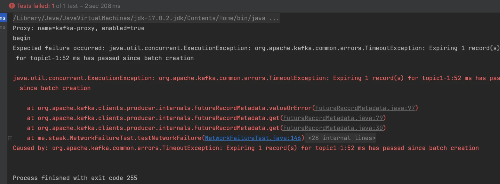

# M1 (arm64) 환경에서 kafka, toxiproxy 설치 후 트랜잭션을 테스트합니다.


### brew  ( m1: arch -arm64) kafka install

- kafka 3.9.0
- https://learn.conduktor.io/kafka/how-to-install-apache-kafka-on-mac-with-homebrew/

```java
brew install kafka

cd /opt/homebrew/opt
kafka/bin/zookeeper-server-start ../etc/zookeeper/zoo.cfg # 3.9.0 에러발생함.
kafka/bin/zookeeper-server-start ../etc/kafka/zookeeper.properties

cd /opt/homebrew/opt
kafka/bin/kafka-server-start ../etc/kafka/server.properties

kafka-topics --create --bootstrap-server localhost:9092 --replication-factor 1 --partitions 1 --topic test
Created topic test.

kafka-topics --list --bootstrap-server localhost:9092
test
```


```java
# 1. 주키퍼 시작 (첫 번째 터미널)
zookeeper-server-start /opt/homebrew/etc/kafka/zookeeper.properties

# 2. 주키퍼가 완전히 시작될 때까지 대기 (약 10초)

# 3. 카프카 시작 (두 번째 터미널)
kafka-server-start /opt/homebrew/etc/kafka/server.properties

# topic1 생성
kafka-topics --create --bootstrap-server localhost:9092 --replication-factor 1 --partitions 3 --topic topic3

# topic2 생성
kafka-topics --create --bootstrap-server localhost:9092 --replication-factor 1 --partitions 3 --topic topic2

# 토픽 삭제
kafka-topics --delete --bootstrap-server localhost:9092 --topic topic1

# 토픽 생성
# 토픽 생성 확인
kafka-topics --list --bootstrap-server localhost:9092

kafka-console-consumer --bootstrap-server localhost:9092 --topic topic1 --from-beginning --isolation-level read_committed

# Maven 프로젝트 디렉토리에서
mvn test

컨슈머 그룹 확인:
kafka-consumer-groups --bootstrap-server localhost:9092 --list

특정 컨슈머 그룹 상세 정보:
kafka-consumer-groups --bootstrap-server localhost:9092 --describe --group my-group-id

불러오기 컨슈머
kafka-console-consumer --bootstrap-server localhost:9092 --topic topic1 --from-beginning --isolation-level read_committed

kafka-console-consumer --bootstrap-server localhost:9092 --topic topic1 --from-beginning --isolation-level read_uncommitted
```


### toxiproxy 설치, 명령어

```java
brew install toxiproxy

# toxiproxy 서버 시작
toxiproxy-server # amd
arch -arm64 toxiproxy-server # arm64

# 프록시 생성
toxiproxy-cli create -l 127.0.0.1:8475 -u 127.0.0.1:9092 kafka-proxy
( toxiproxy-cli create kafka --listen 127.0.0.1:8474 --upstream 127.0.0.1:9092)

# 생성된 프록시 확인
toxiproxy-cli list

# 특정 프록시 삭제
toxiproxy-cli delete kafka-proxy

# 모든 프록시 삭제
toxiproxy-cli delete --all

# 서비스 확인
lsof -PiTCP -sTCP:LISTEN | grep toxi

# upstream 에 카프카 연결되었는 지 확인
curl -v http://localhost:8474/proxies
curl -v http://127.0.0.1:8475/version

# server shutdown
toxiproxy-server shutdown

# 로그 설정 (아직 안해봄)
toxiproxy-server --config /path/to/config.json
```


### 트랜잭션 격리수준 데이터 확인

```java
# committed 메시지만 확인
kafka-console-consumer --bootstrap-server localhost:9092 --topic topic1 --from-beginning --isolation-level read_committed

# uncommitted 메시지도 확인
kafka-console-consumer --bootstrap-server localhost:9092 --topic topic1 --from-beginning --isolation-level read_uncommitted
```


### 네트워크지연 테스트

~~~
mvn test -Dtest=NetworkFailureTest
~~~




### 타임아웃 테스트

```java
mvn test -Dtest=TimeOutTest
```

Timeout occurred as expected
