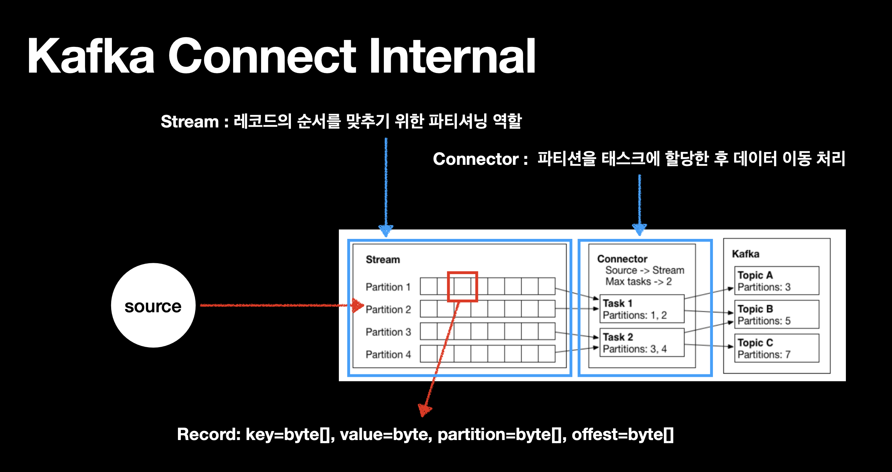
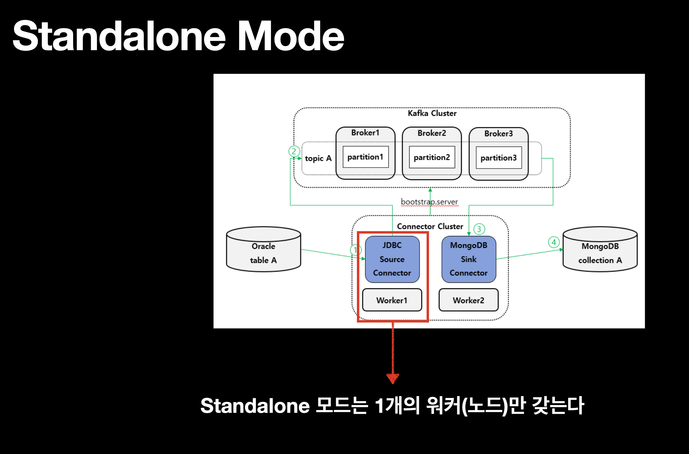
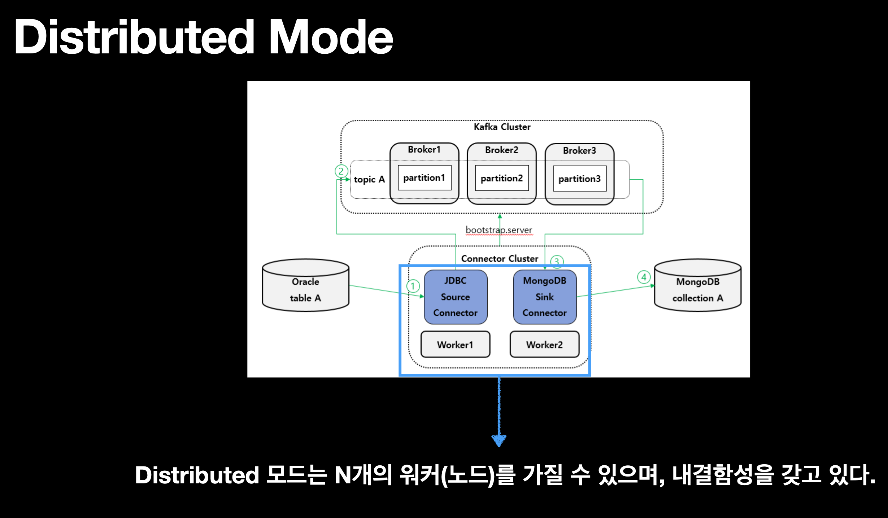
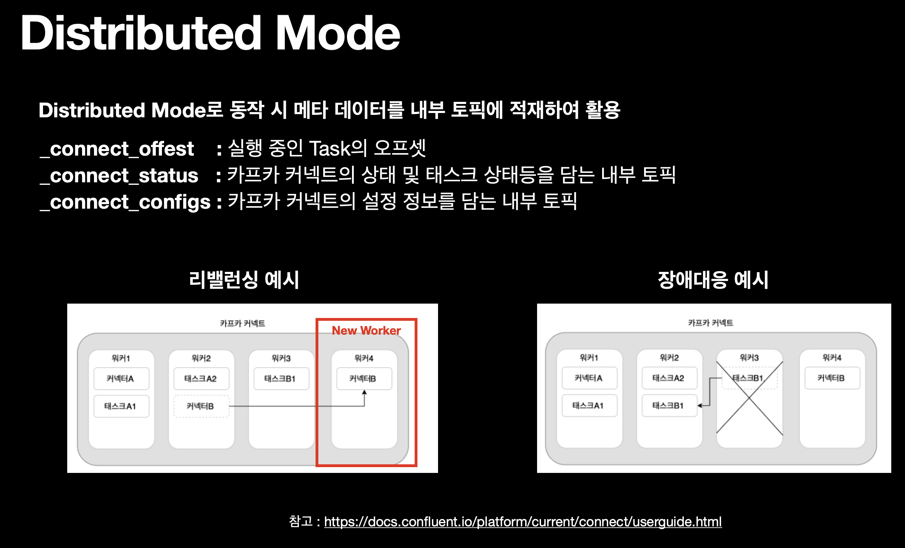

Key Takeaways:
```
- 카프카는 데이터 파이프라인의 단계 사이에서 안정적인 버퍼 역할
- ETL 과 ELT의 차이
- 데이터 쓰기/읽기 작업의 분리 가능
- Kafka Connect는 왜 쓸까?(카프카 커넥트 vs 프로듀서/컨슈머)
- 카프카가 메인 이벤트 스트리밍 플랫폼으로 쓰이는 대표적인 예시가 Kappa 아키텍처(cf. 람다 아키텍처와의 차이)
```

- 데이터 파이프라인 구축시 고려사항
1. 적시성(Tineliness):
2. 신뢰성(Reliability)
3.
4. 데이터 형식:
- Kafka는 데이터를 저장하고 전달하는 역할만 함. JSON이든 Avro든 Protobuf든, 심지어 단순한 문자열이든, 
- Kafka는 그것을 바이트 스트림으로 저장할 뿐이고, 
- 데이터를 해석하는 것은 Producer와 Consumer의 책임임.










dvd 
- https://dog-developers.tistory.com/126


- https://www.youtube.com/watch?v=tSfEB-HTnDQ


카프카 파이프라인
https://www.adservio.fr/post/how-to-build-a-data-pipeline-using-kafka-spark-and-hive
