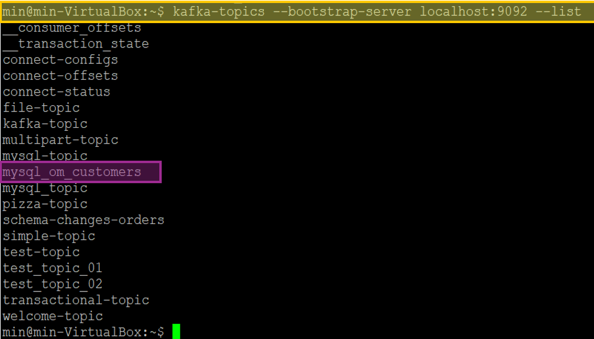

# Chapter 09. 데이터 파이프라인 구축하기

- Apache Kafka에서 '정확히 한 번(Exactly Once)' 의미는 두 가지 핵심 기능, 멱등적 프로듀서(idempotent producer)와 트랜잭션(transaction)의 조합으로 이루어져 있습니다.

## **9.1 데이터 파이프라인 구축 시 고려사항**

### **9.1.1 적시성**
- 적시성(Timeliness)은 데이터가 생성된 후 가능한 한 빠른 시간 내에 수집, 접송, 처리되어 최종 사용자나 시스템에 도달하는 속도를 의미합니다.
- 실시간 분석, 모니터링, 경고 시스템 등에서는 적시성이 매우 중요한 요소입니다. 

### **9.1.2 신뢰성**
- 신뢰성에 대해 생각할 때 중요한 또 다른 고려사항은 전달 보장(delivery guarantee)이다.
- 카프카는 자체적으로 '최소 한 번'전달을 보장하며, 트랜잭션 모델이나 고유 키를 지원하는 외부 데이터 저장소와 결합됐을 때 '정확히 한 번'까지도 보장이 가능하다.
- 카프카 커넥트 API가 오프셋을 다룰 때 외부 시스템과의 통합을 지원하는 API를 제공하기 때문에 '정확히 한 번'전달을 보장하는 파이프라인을 구축하기 위한 커넥터를 개발하는 것 역시 더 쉬워졌다.

### **9.1.3 높으면서도 조정 가능한 처리율**

## **9.2 카프카 커넥트 vs 프로듀서/컨슈머**

- Kafka Connect와 Kafka Client는 각각의 용도와 상황에 따라 선택할 수 있음. 
  - **Kafka Connect**가 적절한 경우
    - 간단한 데이터 연동 애플리케이션이라면, 사전 제작된 커넥터가 존재하고 설정만으로 충분히 처리할 수 있는 경우 Kafka Connect를 사용하는 것이 더 적절함.
    - Kafka Connect는 사전 제작된 커넥터(JDBC, ES, HDFS등)를 활용하여 설정만으로 외부 데이터 저장소와 Kafka를 연동할 수 있음.
  - **Kafka Client**가 적절한 경우
    - 연동과정에서 만약 특별한 커스텀 처리나 복잡한 비즈니스 로직이 필요하다면 Kafka Client를 사용하여 직접 개발하는 방법을 고려할 수 있음.

## **9.3 카프카 커넥트**
- Kafka Connect는 Apache Kafka의 구성 요소 중 하나로, Kafka와 외부 시스템(데이터베이스, 파일 시스템, 검색 엔진 등)간의 데이터 이동을 쉽고 안정적으로 처리할 수 있도록 도와주는 프레임워크
- 직접 Kafka Client(Producer/Consumer)를 코딩하지 않고도, 데이터 소스와 싱크(저장소)를 연결할 수 있도록 표준화된 인터페이스와 미리 만들어진 커넥터를 제공함.
- Source Connector Task는 원본 시스템으로부터 데이터를 읽어와서 커넥트 자료 객체의 형태로 워커 프로세스에 전달만 해주면 된다.
- Sink Connector Task는 워커로부터 커넥트 자료 객체를 받아서 대상 
- 카프카 커넥트는 자료 객체를 카프카에 쓸 때 사용되는 형식으로 바꿀 수 있도록 Convertor를 사용함.

### **9.3.1 카프카 커넥트 실행하기**
- **커넥트 워커의 핵심 설정**
1. bootstrap.servers
- Kafka Client(Producer, Consumer, Kafka Connector)가 Kafka Cluster에 처음 연결할 때 사용할 초기 브로커 주소 목록을 지정하는 설정 항목
- 이 설정은 Kafka Cluster에 연결하고 메타데이터(클러스터의 브로커 목록, 토픽 정보 등)를 가져오기 위한 진입점 역할

2. group.id
- Kafka Connect 워커들은 모두 동일한 group.id를 사용함으로써 하나의 클러스터를 구성함.
- 동일한 그룹 id를 가진 워커들은 Kafka 내부의 특정 토픽(connect-configs, connect-offsets, connect-status등)을 통해 상태, 오프셋, 구성 정보를 공유하고 조율함.

3. plugin.path  
- 커넥트를 실행할 때 커넥터가 어디에 위치하는지 config파일에 위치를 지정해야 함.
- 커넥터 jar패키지가 있는 디렉토리를 config파일에 지정하게 됨.
- 예: /opt/connectors/jdbc와 /opt/connectors/elastic을 만들고 이 안에 커넥터 jar파일과 모든 의존성들을 저장함.
4. key.converter와 value.converter
- 커넥트는 카프카에 저장된 여러 형식의 데이터를 처리할 수 있음.
- 카프카에 저장될 메시지의 키와 밸류 부분 각각에 대해 컨버터를 설정해 줄 수 있음.

5. rest.host.name과 rest.port
- 커넥터를 설정하거나 모니터링할 때는 카프카 커넥트의 REST API를 사용하는 것이 보통. REST API에 사용할 특정한 포트값을 할당해 줄 수 있음.

### **9.3.2 커넥터 예제: 파일 소스와 파일 싱크**

1&#xFE0F;&#x20E3; 분산모드로 커넥트 생성

2&#xFE0F;&#x20E3; 실행중인 Java 프로세스 확인  

3&#xFE0F;&#x20E3; Kafka Connect가 로드한 플러그인 목록 확인

→ FileStreamSource 커넥터 찾지 못함.

4&#xFE0F;&#x20E3; Kafka 기본 제공 커넥터 다운로드 및 설치

5&#xFE0F;&#x20E3; plugin.path 설정 추가

6&#xFE0F;&#x20E3; 주기퍼 -> 카프카 -> 커넥트 재시작

7&#xFE0F;&#x20E3; Kafka Connect가 로드한 플로인 목록 다시 확인

→ FileStreamSource 커넥터 찾음 ㅎㅎ

8&#xFE0F;&#x20E3; Source Connector 생성

9&#xFE0F;&#x20E3; Source Connector 상태 확인

🔟 test파일에 데이터 추가 및 Kafka에서 데이터가 정상적으로 수집되는지 확인

1️⃣1️⃣ Sink Connector 생성  

1&#xFE0F;&#x20E3;2&#xFE0F;&#x20E3; Sink Connector 정상 등록 확인

1&#xFE0F;&#x20E3;3&#xFE0F;&#x20E3; file-topic에 데이터 추가  

1&#xFE0F;&#x20E3;4&#xFE0F;&#x20E3; /tmp/output.txt에 데이터 잘 저장되었는지 확인  

- Connector Plugins를 먼저 등록한 후에 Connectors를 등록해야 함 (Connector Plugins → Connectors )
- Connector Plugins는 설치된 커넥터 목록이고, 이 플러그인을 기반으로 실제 Connectors를 생성해야 Kafka에서 동작하게 됨.

### **9.3.3 커넥터 예제: MySQL에서 Elasticsearch로 데이터 보내기**
1&#xFE0F;&#x20E3; JDBC Source Connector, MySQL Driver 다운로드  

Jdbc Source Connector의 경우에는 MySQL Driver를 따로 가지고 있지 않다. 그래서 따로 MySQL Driver를 다운로드 해준다.  

2&#xFE0F;&#x20E3; 그리고 plugins.path에 해당 jar파일이 들어있는 경로를 넣어주고, 재부팅한 후에 connector-plugins를 확인하면 JDBS Source Connector와 JDBC Sink Connector가 생성된 것을 확인할 수 있다.

3&#xFE0F;&#x20E3; Kafka Connect에 Connector 등록 

→ 이 Json파일은 Kafka Connect에서 MySQL 데이터를 가져오기 위해 JDBC Source Connector를 설정하는 역할을 함. 

4&#xFE0F;&#x20E3; 등록된 Connector Status 확인

→ state가 RUNNNING이라면 잘 등록된 것

5&#xFE0F;&#x20E3; 토픽 잘 생성되었는지 확인

→ JSON 파일 내에 토픽이 KAFKA에 없다면 자동으로 생성되는데, 자동으로 생성된 것을 확인할 수 있음.

6&#xFE0F;&#x20E3; MySQL에 있는 데이터 Kafka로 잘 보내졌는지 확인
- MySQL 데이터

- Kafka 데이터

→ 잘 들어온 것을 확인할 수 있음.

7&#xFE0F;&#x20E3; 

8&#xFE0F;&#x20E3; 

9&#xFE0F;&#x20E3; 

🔟 

### **9.3.4 개별 메시지 변환**

### **9.3.5 카프카 커넥트: 좀 더 자세히 알아보기**

1. 커넥터(Connector)와 태스크(Task)
  - 커넥트 VS 커넥터
    - 커넥트: 카프카 커넥트는 커넥터를 동작하도록 실행해주는 프로세스. 그래서 파이프라인으로 동작하는 커넥터를 동작하기 위해서 반드시 커넥트를 실행시켜야 함.
    - 커넥터
      - 카프카 커넥터는 실질적으로 데이터를 처리하는 코드가 담긴 jar패키지
      - 커넥터 안에는 파이프라인에 필요한 동작들과 설정 그리고 실행하는 메서드들이 포함되어 있음.
      - 소스 커넥터 vs 토픽 커넥터
      - 소스 커넥터: 데이터 베이스로부터 데이터를 가져와서 토픽에 넣는 역할 즉, 프로듀서의 역할
      - 싱크 커넥터: 특정 토픽에 있는 데이터를 오라클, MySQL, ES와 같이 특정 저장소에 저장을 하는 역할
  
  - 태스크(Task)
    - 데이터를 처리하는 개별 단위. Source Connector 또는 Sink Connector를 설정할 때 병렬로 실행되는 태스크(Task)가 생성되어 데이터를 효율적으로 처리함. 
2. 워커(Worker)
- 워커 프로세스는 커넥터와 그 설정을 정의하는 HTTP 요청을 처리할 뿐만 아니라 커넥터 설정을 내부 카프카 토픽에 저장하고, 커넥터와 태스크를 실행시키고, 여기에 적절한 설정값을 전달해주는 역할을 함.
- Task를 실행하는 노드 (Standalone 또는 Distributed모드)
- Distributed 모드 (분산 모드)

3. 컨버터(Convertor) 및 커넥트 데이터 모델
- 사용자가 워커나 커넥터를 설정할 때, 카프카에 데이터를 저장할 때 사용하고자 하는 컨버터를 선택.
- JsonConverter, AvroConverter 등이 있음

4. 오프셋 관리

## **9.4 카프카 커넥트의 대안**

