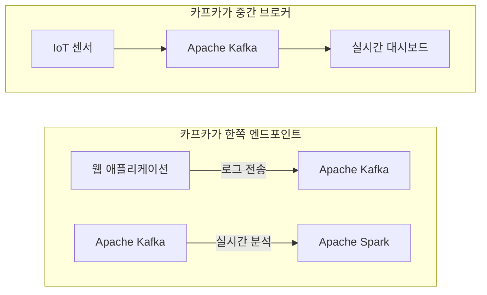

## 개요

> 데이터 파이프라인 구축에 있어서 카프카의 역할은 일종의 안정적인 버퍼이다. 이는 데이터 파이프라인의 데이터를 쓰는 쪽과 읽는 쪽을 분리함으로써 특정 원천에서 가져온 동일한 데이터를 서로 다른 적시성과 가용성 요구조건을 가지는 여러 타겟 어플리케이션이나 시스템으로 보낼 수 있게 한다.

## 01. 데이터 파이프라인 구축시 고려사항

다음 주제에 대해 다룬다.

- 적시성
- 신뢰성
- 높으면서도 조정가능한 처리율
- 데이터 형식
- 변환
- 보안

### 적시성

- 배치성 처리를 하는 파이프라인과 실시간 처리를 하는 파이프라인의 구분
- 적시성 관점에서 카프카는 Reader와 Writer 사이의 시간적 민감도에 대한 요구조건을 분리시키는 버퍼 역할을 한다.
- 데이터의 소비 속도가 온전히 읽는 쪽에 의존하기 대문에 쓰는 쪽에 대한 응답을 늦춤으로서 백프레셔를 걸 수 있다.(권장되는 옵션은 아님)

### 신뢰성

- 시스템 디자인에 있어서 신뢰성은 SPOF를 최대한 피하면서 모든 종류의 이미 발생한 장애에 대해 신속한 복구를 할 수 있어야 한다.
- 신뢰성에 대한 다른 고려사항은 전달 보장(At-least-once, At-most-once, Exactly-once)이다.

### 높으면서도 조정가능한 처리율

- Scalability를 의미

### 데이터 형식

- 카프카 자체와 커넥트 API는 데이터 형식에 대한 제약이 없다.
- 소스와 싱크는 스키마를 가지고 있다 소스에서 데이터와 함께 스키마를 읽어서 저장하고 호환성을 검증하거나 싱크 DB의 스키마를 업데이트할 수 있다.
- 카프카의 데이터를 외부 시스템에 쓸 경우 Sync Connector를 통해 외부 시스템에 쓰여지는 데이터를 관리한다.

### 변환

- ETL과 ELT의 주요 트레이드오프를 이해할 필요가 있다

| 비교 기준               | ETL (Extract, Transform, Load)                                                     | ELT (Extract, Load, Transform)                                              |
| ----------------------- | ---------------------------------------------------------------------------------- | --------------------------------------------------------------------------- |
| 데이터 처리 속도와 성능 | • 변환된 데이터만 적재하여 타겟 시스템 부하 적음 • 순차적 처리로 인한 속도 제한 | • 더 많은 스토리지 필요 • 병렬 처리로 높은 성능 가능                     |
| 유연성과 재사용성       | • 한번 변환된 데이터는 재처리 어려움 • 새로운 요구사항에 파이프라인 재구성 필요 | • 원본 데이터 보존으로 유연한 변환 가능 • 다양한 분석 요구사항 수용 용이 |
| 비용 구조               | • 별도 변환 서버 운영 비용 발생 • 상대적으로 적은 스토리지 비용                 | • 변환 서버 비용 절감 • 큰 스토리지와 강력한 컴퓨팅 자원 비용 발생       |
| 데이터 품질과 거버넌스  | • 적재 전 검증/정제로 높은 품질 보장 • 체계적인 품질 관리 가능                  | • 원본 데이터 문제가 적재될 수 있음 • 변환 후 품질 관리가 더 복잡        |
| 개발 및 유지보수        | • 복잡한 변환 로직 개발/디버깅 용이 • 상대적으로 높은 개발 비용                 | • SQL 기반으로 개발 용이 • 복잡한 로직의 디버깅/최적화 어려움            |
| 실시간성                | • 변환 과정에서 지연 발생 • 실시간 처리에 제한적                                | • 빠른 데이터 적재 가능 • 필요 시점 변환으로 실시간성 확보               |

### 보안

- 데이터 암호화
- 데이터 접근 및 변경에 대한 제어
- PII 데이터 마스킹
- 기본적으로 카프카 커넥트와 커넥터는 외부데이터 시스템에 연결되고 인증할 수 있어야 하며 커넥터 설정 또한 자격증명을 포함해야 한다.

## 02. Kafka Connect와 Producer/Consumer 사이에서 선택하기

카프카 커넥트는 카프카를 직접 코드나 API를 사용하지 않고 데이터 소스와 싱크를 연결하고자 할 때 사용한다.

## 03. Kafka Connect

### Kafka Connect Architecture

Kafka Connect는 기본적으로 Standalone 모드와 Distributed 모드를 제공하며 분산 모드에서에 동작할 때 고가용성과 확장성을 제공한다.

**1. 워커 프로세스 (Worker Process)** :
커넥터와 태스크를 실행하는 JVM 프로세스. task thread를 담는 일종의 컨테이너. 분산 모드에서는 클러스터의 워커 프로세스중 하나가 리더로 선출되어 작업을 조율한다.

- 분산 모드에서는 여러 워커가 클러스터를 형성하여 부하 분산 및 장애 복구를 처리
- REST API를 통해 커넥터 관리
- Kafka의 config, offset, status 토픽을 사용해 상태 동기화
- 워커 간 리더 선출을 통해 작업을 조율
- 하나의 워커가 다수의 커넥터와 태스크를 실행가능

**2. 커넥터 (Connector)** : 외부 시스템과의 연결을 정의. Task 생성

Source Connector: 외부 시스템 → Kafka로 데이터 수집
Sink Connector: Kafka → 외부 시스템으로 데이터 전송

- 커넥터는 태스크를 생성하여 병렬 처리를 관리
- 설정 파일(config)을 통해 동작을 제어

**3. 태스크 (Task)** : 데이터 이동의 실제 실행 단위

커넥터는 동일한 타입의 여러 태스크를 생성해 병렬 처리

**Source Task**

- 기본적으로 읽는 역할
- 외부 시스템에서 데이터를 읽어 Kafka 토픽으로 전송
- poll() 메서드를 주기적으로 호출해 데이터 수집

**Sink Task**

- 기본적으로 쓰는 역할
- Kafka 토픽의 데이터를 읽어 외부 시스템에 저장
- put() 메서드로 데이터를 일괄 처리

**4. 컨버터 (Converter)**
: Kafka 메시지의 직렬화/역직렬화를 담당

- 데이터 형식 변환 ex)JSON ↔ Avro

주요 컨버터:

- StringConverter: 텍스트 기반 데이터 처리.
- JsonConverter: JSON 형식 변환.
- AvroConverter: 스키마 기반 Avro 형식 변환 (Schema Registry와 연동).

---

**_Concept_**

- **Worker Process** : 커넥터와 태스크를 실행하는 JVM 프로세스 . task thread를 담는 일종의 컨테이너 . 분산 모드에서는 클러스터의 워커 프로세스중 하나가 리더로 선출되어 작업을 조율한다.
- **Connector** : 외부 시스템과의 연결을 정의, Task 생성
- **Task** : 데이터 통합의 실제 실행 단위
- **Source Task** : 외부 시스템 → Kafka로 데이터 수집
- **Sink Task** : Kafka → 외부 시스템으로 데이터 전송
- **Connector** : :Kafka 메시지의 직렬화/역직렬화를 담당

---

**Kafka Connect 구성 예제**

### CDC(Change Data Capture)

---

**_Concept_**

- **CDC** : capture data change . WAL, REDO LOG 등의 트랜잭션 로그를 읽어서 관계형 DB의 변경을 탐지하는 방식. 대부분의 ETL 시스템은 CDC를 데이터 저장소로 사용한다.

---

## 04. Kafka Connect의 대안

- Apache Nifi

---

**_Key Takeaway_**

- 데이터 파이프라인을 구현할 때 중요한 것 중 하나는 데이터 원본과 대상을 분리할 수 있어야 한다는 것이다.
  카프카 커넥트는 카프카를 직접 코드나 API를 사용하지 않고 데이터 소스와 싱크를 연결하고자 할 때 사용한다.

---

## Reference

- 카프카 핵심 가이드
