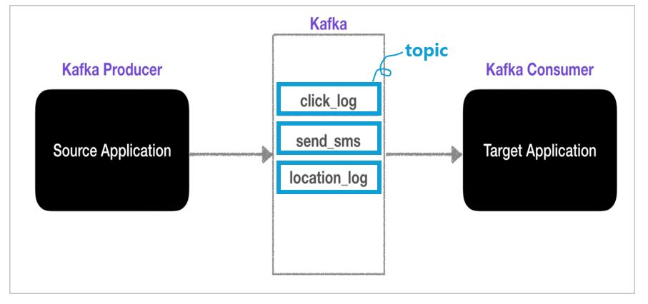
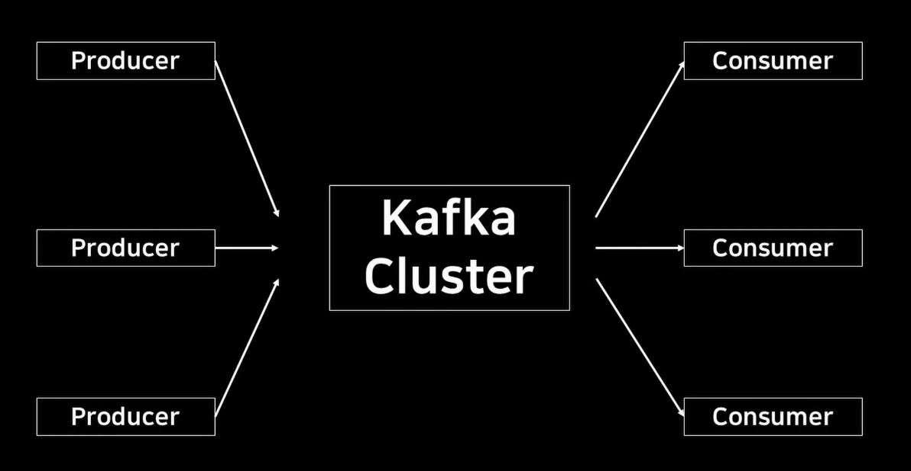

# chapter01 카프카 시작하기

## **1.2 카프카 입문**

- 아파치 카프카는 메시지 발행/구독 시스템이다.
- '분산 커밋 로그' 혹은 '분산 스트리밍 플랫폼'이라 불리기도 한다.
- 카프카에 저장된 데이터는 순서를 유지한 채로 지속성 있게 보관되며 결정적으로 읽을 수 있다. 또한 확장시 성능을 향상시키고 실패가 발생하더라도 데이터 사용에는 문제가 없도록 시스템 안에서 데이터를 분산시켜 저장할 수 있다.

### **1.2.1 메시지와 배치**
- 카프카에서 데이터의 기본 단위는 메시지(message)이다. 
- 카프카의 입장에서 메시지는 단순히 바이트의 배열일 뿐이기 때문에 여기에 포함된 데이터에는 특정한 형식이나 의미가 없다.
- 메시지는 키(key)라 불리는 메타데이터를 포함할 수도 있다.
- 카프카는 효율성을 위해 메시지를 배치(batch)단위로 저장한다.
- 배치는 그저 같은 토픽의 파티션에 쓰여지는 메시지들의 집합일 뿐이다. 

### **1.2.2 스키마**
- 카프카 입장에서 메시지는 단순히 바이트 배열일 뿐이지만, 내용을 이해하기 쉽도록 일정한 구조(혹은 스키마)를 부여하는 것이 권장된다. 
- 각 애플리케이션의 필요에 따라 사용 가능한 메시지 스키마에는 여러 가지가 있는데, 가장 간단한 방법으로는 쓰기 쉽고 사람이 알아볼 수 있는 JSON이나 XML이 있다.
- 하지만 이 방식들은 타입 처리 기능이나 스키마 버전 간의 호환성 유지 기능이 떨어진다.
- 많은 아파치 카프카 개발자들은 아파치 에이브로(Avro)를 선호한다.
- 아파치 에이브로: 조밀한 직렬화 형식을 제공하는 데다 메시지 본체와 스키마를 분리하기 때문에 스키마가 변경되더라도 코드를 생성할 필요가 없다.

### **1.2.3 토픽과 파티션**

- 카프카에 저장되는 메시지는 토픽(topic)단위로 분류된다. 토픽은 데이터베이스의 테이블이나 파일시스템의 폴더와 유사한 성질을 가지고 있는데, producer가 토픽에 데이터를 넣게 되고 consumer는 이 데이터를 가져가게 된다.
- 토픽은 이름을 가질수도 있는데, 목적에 따라 click_log, send_sms, location_log 등과 같이 무슨 데이터를 담는지 명확하게 명시해주면 추후 유지 보수시 편리하게 관리할 수 있다.

- 토픽은 다시 여러 개의 파티션으로 나누어진다.
- 하나의 토픽은 여러 개의 파티션으로 구성될 수 있으며 첫 번째 파티션 번호는 0번부터 시작하게 된다.
- 하나의 파티션은 큐와 같이 내부에 데이터가 파티션 끝에서부터 차곡차곡 쌓이게 되고 click_log 토픽에 kafka consumer가 붙으면 kafka가 데이터를 가장 오래된 순서부터 가져가게 된다.
- 더이상 데이터가 들어오지 않으면 consumer는 또 다른 데이터가 들어올 때까지 기다림.
- consumer가 토픽 내부의 파티션에서 데이터를 가져가더라도 데이터는 삭제되지 않으며 새로운 consumer가 붙었을 때 다시 0번부터 데이터를 가져감
  - 이때 전제조건 2가지 
  - 1. consumer 그룹이 달라야함
  - 2. auto.offset.reset = earliest 
- 이처럼 사용할 경우 동일 데이터에 대해서 2번 처리할 수 있는데, 이는 카프카를 사용하는 아주 중요한 이유이기도 함.

### **1.2.4 프로듀서와 컨슈머**

- 프로듀서는 새로운 데이터를 생성하고 kafka cluster로 데이터를 전송하는 역할을 함
- 컨슈머는 데이터를 읽어오는 역할을 함

### **1.2.5 브로커와 클러스터**

- 브로커: 하나의 카프카 서버, 메시지를 저장하고 전달하는 역할을 하는 Kafka의 핵심 구성 요소 
- 브로커는 프로듀서로부터 메시지를 전달받아 오프셋을 할당한 뒤 디스크 저장소에 쓴다.
- 오프셋(offset): 메시지가 특정 파티션에서 몇 번째 위치에 저장되어 있는지를 나타내는 고유한 번호. 즉, 카프카 메시지의 '순번'이라고 생각하면 됨.
- 카프카 브로커는 클러스터의 일부로서 작동하도록 설계되었다. 하나의 클러스터 안에 여러 개의 브로커가 포함될 수 있으며, 그중 하나의 브로커가 클러스터 컨트롤러의 역할을 하게 된다.
- Zookeeper: Kafka 클러스터를 관리하고 조정하는 데 필요한 메타데이터 관리 시스템으로, Kafka가 제대로 동작하도록 클러스터의 상태를 유지하고 브로커 간의 통신을 도와주는 역할을 함.

### **1.2.6 다중 클러스터**

- 다중 클러스터는 하나의 환경에서 여러 개의 클러스터를 운영하는 것을 말한다.
- 이 개념은 주로 데이터 처리와 분산 시스템(예: kafka, Databricks 등)에서 사용된다.
- 다중 클러스터는 여러 작업을 분리하고 효율성을 높이는 구조. 데이터와 작업을 독립적으로 관리할 수 있어 확장성과 보안이 좋아진다.
- 예시로 Databricks 다중 클러스터
  - 클러스터1 : 데이터 전처리(ETL)
  - 클러스터2 : 데이터 분석
  - 클러스터3 : 모델훈련(ML)
  - 이렇게 각 작업에 맞는 클러스터를 사용해 리소스를 최적화할 수 있음.

