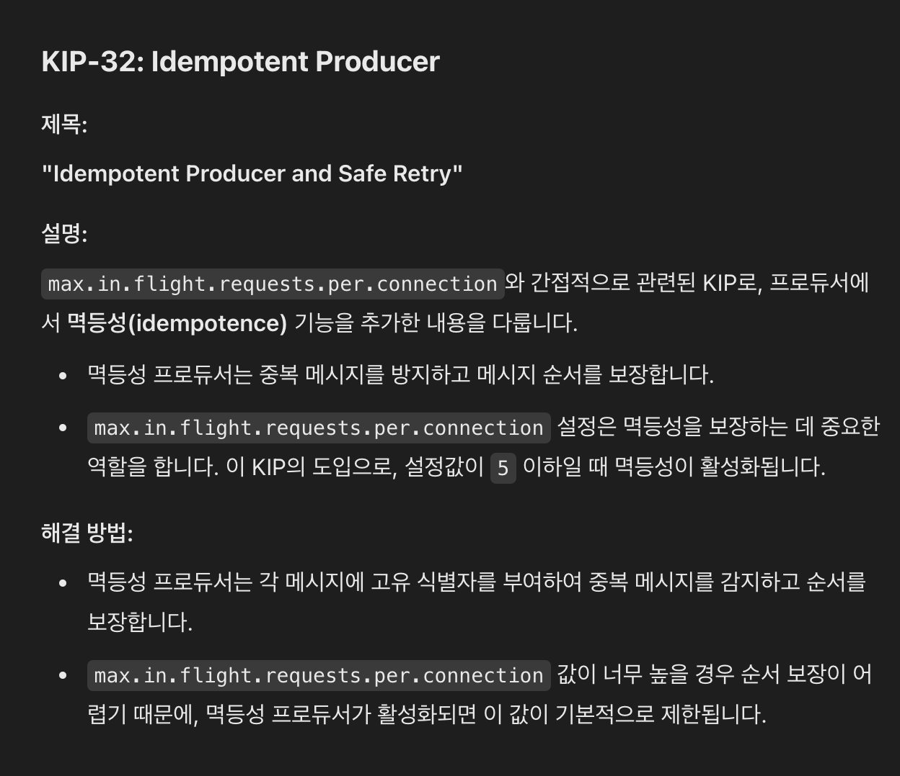
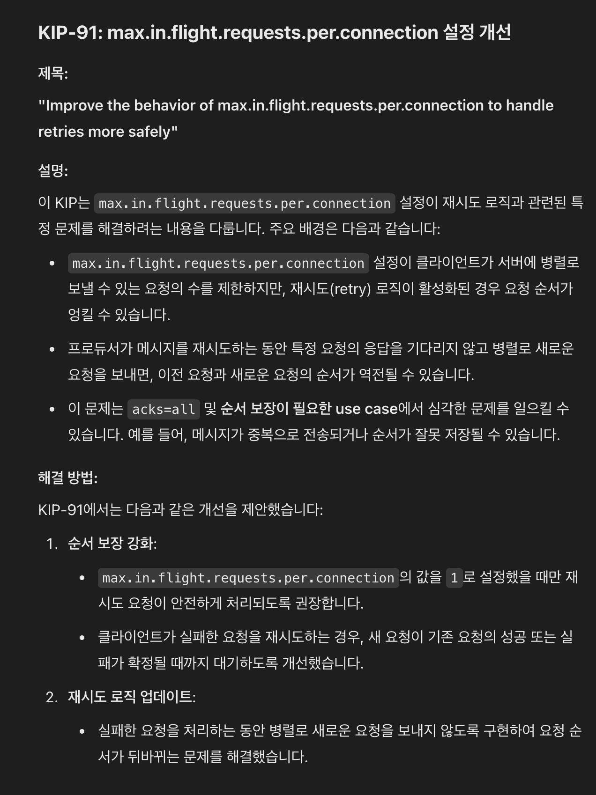

https://kafka.apache.org/protocol
https://cwiki.apache.org/confluence/display/KAFKA/Clients

### Network
```
Kafka uses a binary protocol over TCP. The protocol defines all APIs as request response message pairs. All messages are size delimited and are made up of the following primitive types.
The client initiates a socket connection and then writes a sequence of request messages and reads back the corresponding response message. 
No handshake is required on connection or disconnection. TCP is happier if you maintain persistent connections used for many requests to amortize the cost of the TCP handshake, but beyond this penalty connecting is pretty cheap.
The client will likely need to maintain a connection to multiple brokers, as data is partitioned and the clients will need to talk to the server that has their data. However it should not generally be necessary to maintain multiple connections to a single broker from a single client instance (i.e. connection pooling).
The server guarantees that on a single TCP connection, requests will be processed in the order they are sent and responses will return in that order as well. The broker's request processing allows only a single in-flight request per connection in order to guarantee this ordering.
Note that clients can (and ideally should) use non-blocking IO to implement request pipelining and achieve higher throughput. i.e., clients can send requests even while awaiting responses for preceding requests since the outstanding requests will be buffered in the underlying OS socket buffer.
All requests are initiated by the client, and result in a corresponding response message from the server except where noted.
The server has a configurable maximum limit on request size and any request that exceeds this limit will result in the socket being disconnected.
```


## Binary Wire Protocol
```
The HTTP-NG team proposed the Binary Wire Protocol to enhance how the next-generation HTTP protocol supports remote operations.
HTTP-NG defines "object types” and assigns each object type a list of methods. Each object type is assigned a URI, so its description and methods can be advertised.
In this way, HTTP-NG is proposing a more extensible and object-oriented execution model than that provided with HTTP/1.1, where all methods were statically defined in the servers.
The Binary Wire Protocol carries operation-invocation requests from the client to the server and operation-result replies from the server to the client across a stateful connection.
The stateful connection provides extra efficiency.
Request messages contain the operation, the target object, and optional data values. Reply messages carry back the termination status of the operation,
the serial number of the matching request (allowing arbitrary ordering of parallel requests and responses), and optional return values.
In addition to request and reply messages, this protocol defines several internal control messages used to improve the efficiency and robustness of the connection.
```

.png)


https://www.w3.org/TR/1998/WD-HTTP-NG-wire-19980710/

#### ProducerRecord 객체
```
- 카프카에 메시지를 쓰는 작업은 ProducerRecord 객체를 생성
- 필수: topic, value
- 선택: key, partitions
- 가장 먼저 하는 일은 key와 value 객체가 네트워크 상에서 전송될 수 있도록 바이트 배열로 변환하는 과정

```

#### RecordMetadata 객체


#### concurrent.futures.Future
```
- 스레드나 프로세스를 사용해 비동기 작업의 결과를 관리합니다.
- ThreadPoolExecutor 또는 ProcessPoolExecutor에서 작업을 제출하면 Future 객체가 반환됩니다.
```

#### asyncio.Future
```
asyncio 라이브러리에서 사용하는 Future 객체로, 비동기 코루틴 기반의 작업 결과를 관리합니다.
```

### Future vs. Promise
```
Future는 주로 결과를 얻거나 대기하기 위한 "결과 객체"를 의미합니다.
Promise는 보통 비동기 작업이 끝나면 결과를 전달하거나 상태를 업데이트하는 "행위"를 포함합니다.
```


중요한 포인트들은 이정도로 이야기하고

중요 설정을 다시 살펴 보고
https://devidea.tistory.com/90

max.in.flight.requests.per.connection

##### KIP32


##### KIP91

https://cwiki.apache.org/confluence/display/KAFKA/An+analysis+of+the+impact+of+max.in.flight.requests.per.connection+and+acks+on+Producer+performance


### 책에 없는 다른 소스에서 중요한 내용 다시 살펴보기
https://d2.naver.com/helloworld/6560422


cf) 기타 참고 자료
- https://quix.io/blog/how-to-use-gzip-data-compression-with-apache-kafka-and-python
