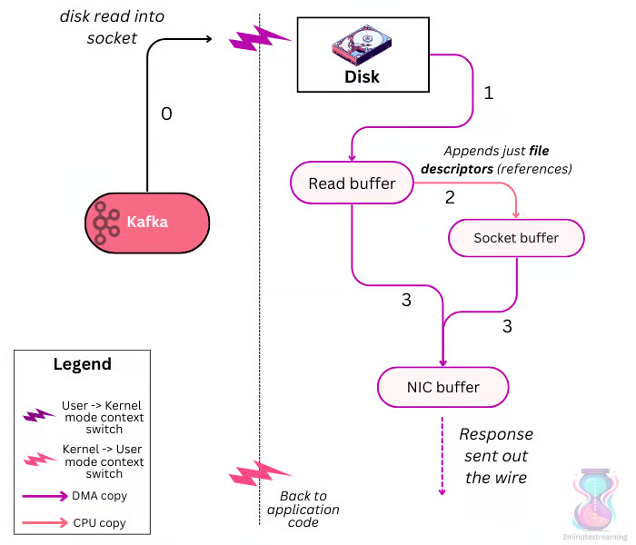

## Zero-Copy

> Zero Copy의 개념과 기본적인 동작 방식

## 사전에 알면 좋은 개념

---

**_Concept_**

- **Zero-Copy** : 디스크의 데이터를 Application buffer를 거치지 않고 커널에서 직접 네트워크로 전송하는 기법. 디스크에서 네트워크로 데이터를 전송할 때 NIC card로 직접 전송하는 방식. 불필요한 데이터 복사를 제거하여 시스템 성능을 향상시킴
- **DMA** : Direct Memory Access. CPU 개입 없이 메모리와 간 데이터 전송이 가능한 하드웨어 메커니즘. 사실상 Zero-Copy를 구현하는 핵심 기술
- **socket buffer** : Network 통신에서 데이터를 임시 저장하는 커널 메모리 공간. 송수신 데이터의 버퍼링을 담당
- **pache cache** : 기본적으로는 disk I/O 성능 향상을 위해 파일 시스템의 데이터를 메모리에 캐싱하는 것. zero copy관점에서는 read buffer로 사용됨.
- **NIC** : Neitwork Interface Card. 이더넷 카드 .컴퓨터를 네트워크에 연결하는 하드웨어 장치
- **NIC buffer** : NIC에 내장된 메모리로, 네트워크 패킷을 임시 저장하는 공간

---

## No Zero-Copy data transfer

> Zero-Copy를 사용하지 않는 데이터 전송 방식

1. 프로세스가 read() system call을 호출. 디스크 데이터를 Read buffer(page cache)로 복사 (user -> kernel)
2. 커널이 페이지 캐시의 데이터를 Application buffer로 복사. (kernel -> user)
3. 프로세스가 write() system call을 호출. (user -> kernel)
4. 커널이 Application buffer의 데이터를 Socket buffer로 복사. (user -> kernel)
5. Socket buffer의 데이터가 NIC buffer로 복사됨. (kernel -> user)

기본적으로 전송과정에서에 4번의 컨텍스트 스위칭이 발생하며, 데이터를 복사하는 과정이 많아 CPU 사용량과 지연시간이 증가한다.

**컨텍스트 스위칭**

- read() 호출 시 디스크 데이터를 커널의 Read buffer로 복사하는 과정에서 커널 모드로 전환
- Read buffer의 데이터를 Application buffer로 복사하는 과정에서 유저 모드로 전환
- Application buffer의 데이터를 Socket buffer로 복사하는 과정에서 커널 모드로 전환
- Socket buffer의 데이터를 NIC 버퍼로 복사하는 과정에서 유저 모드로 전환. send() 호출 종료 시 유저 모드로 전환

## Zero-Copy data transfer

1. 프로세스가 sendfile() 시스템 콜을 호출 .디스크 데이터를 Read buffer로 복사 (user -> kernel)
2. **DMA 엔진이 Read buffer의 데이터를 직접 NIC buffer에 전송** (kernel -> kernel)
3. **Read buffer의 데이터를 socket buffer로 전송** (정확히는 포인터)
4. NIC가 데이터를 네트워크로 전송

---

**_Concept_**

- **scatter-gather** : Read buffer의 포인터를 Socket buffer로 복사하는 방식. DMA 엔진이 Socket buffer의 포인터를 통해 데이터를 NIC buffer로 전송

---

- sendfile() 시스템 콜이 커널 내에서 모든 작업을 처리하도록 설계되었기 때문에 컨텍스트 스위칭이 최소화되며 이에 따른 오버헤드가 줄어들면서 성능이 향상된다.

## Zero-Copy in Kafka

- 네트워크를 통해 전달되는 형식과 디스크에 전달되는 형식으로 통일함으로써 제로 카피 최적화를 달성할 수 있다.
- Kafka의 zero copy는 디스크에서 네트워크로 데이터를 전송할 때 Application buffer를 거치지 않고 직접 전송하는 방식이다. 기존의 read/write 방식은 커널 버퍼와 유저 버퍼를 오가며 4번의 컨텍스트 스위칭이 발생하지만, zero copy는 sendfile() 시스템 콜을 사용해 page cache와 socket buffer로 직접 전송하여 CPU 사용량과 지연시간을 크게 줄인다. 중요한 것은 커널 스페이스 내에서만 데이터가 이동한다는 것이다.
